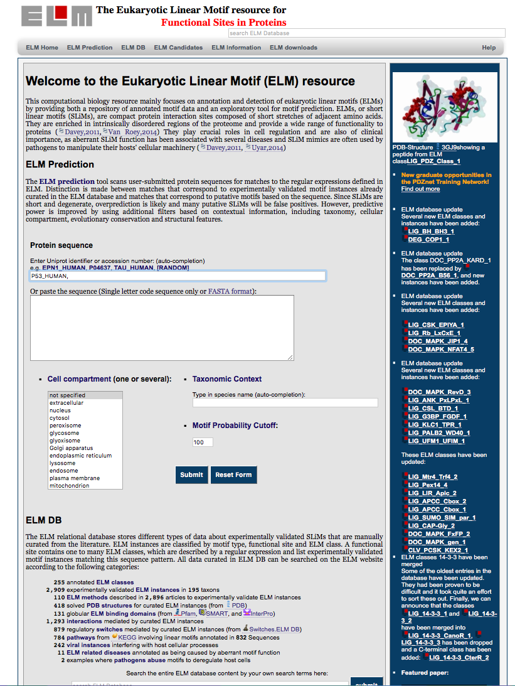
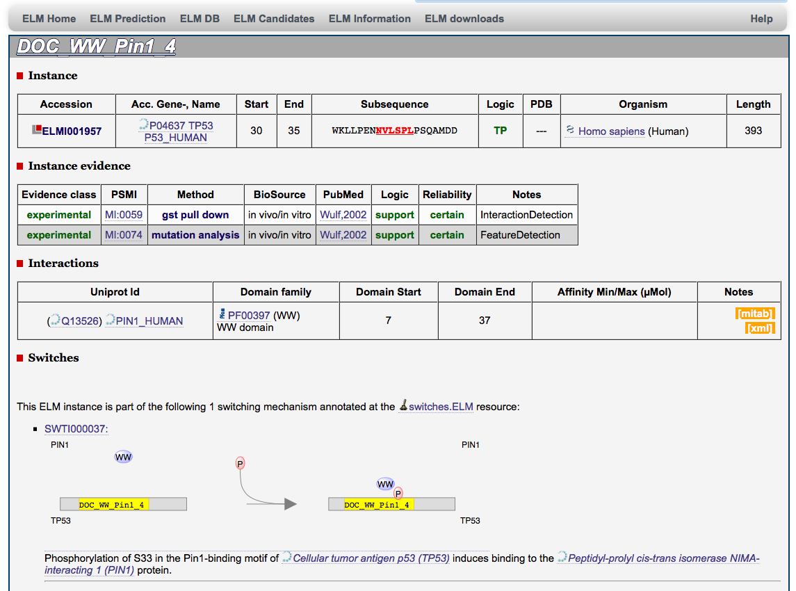
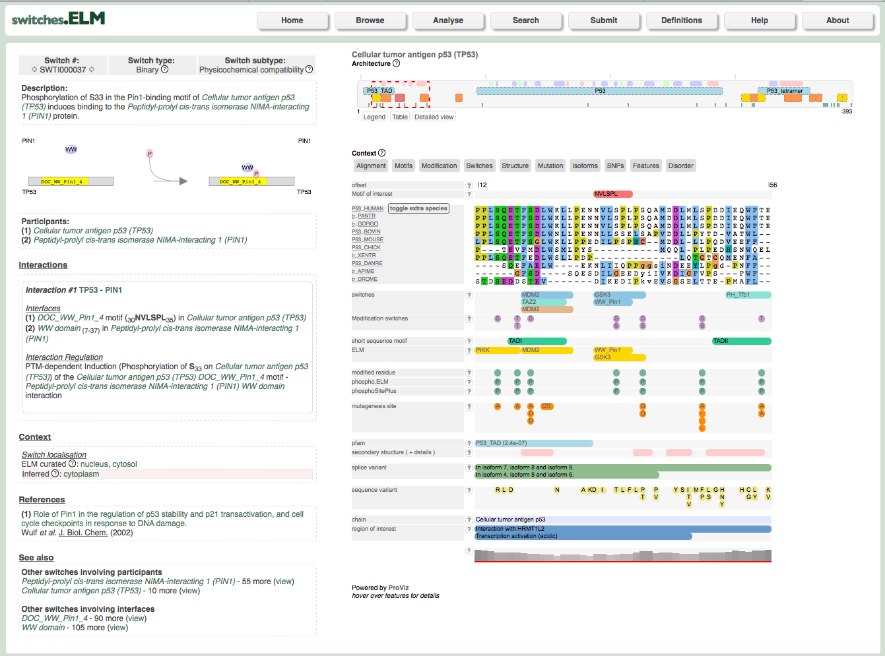

# Basic protocol 1: explore the manually curated information for the p53 protein in the ELM DB

*(introduction goes here)*

## Necessary Resources

### Software

### Hardware 

Step 1. Open your browser (any one which we should not recommend?) at
http://elm.eu.org and enter the Uniprot identifier or accession number of the
protein, e.g. P53_HUMAN, for which you would like to explore the information
stored in the ELM DB. Select the specie and the cellular compartment
(optional), then click submit (Fig. 1a and 1b)

**Figure 1a**

**Figure 1b** If the protein of interest has some annotation in the ELM DB the
information relative the sequence, cell compartment and taxonomy will be
automatically filled.

Step 2. The page results will open in a new tab (Fig.2)

**Figure 2**

Step 3. This page show the list of predicted and annotated ELM for p53. For
details on the predicted ELM see the chapter xxx. Scroll down the page until
the section with the p53 instances annotated from the literature. (Fig.3)
 

**Figure 3**

Step 4. In order to view the information relative to the p53 annotates
instances one can a) click on the Elm Name, e.g. DOC_CYCLIN_1, to go to the
page with the information relative to this ELM motif and then click on p53
motif subsequence (GQSTSRHKKLMFKTEGPDSD) in the instance table (Fig.4), or b)
click on the position of the p53 instance, i.e. 381-385, for the DOC_CYCLIN_1
motif (Fig.5).

**Figure 4**

**Figure 5**

Step 5. Data relative to the instance evidences include: Evidence class, PSMI
id and Method name, type of evidence, reference, Logic, Reliability and Notes
(internal method classification).  How much description should we add here,
e.g. is enough to mention that for the methods ELM use the PSMI ontology and
provide the link? 

Following the links to external DB are available relative to:
Instance
- http://www.uniprot.org/uniprot/P04637
- http://www.rcsb.org/pdb/explore/explore.do?pdbId=1H26
- https://www.ncbi.nlm.nih.gov/Taxonomy/Browser/wwwtax.cgi?mode=Info&id=9606

Instance evidence
- http://www.ebi.ac.uk/ols/ontologies/mi/terms?obo_id=MI%3A0405
- https://www.ncbi.nlm.nih.gov/pubmed/10884347

Pathway
- http://www.kegg.jp/kegg-bin/show_pathway?map=hsa04210&mapscale=1.0&show_description=hide&multi_query=hsa:7157+red,black%0D%0A

Step 6. Go back to the table with the p53 annotated instance (Fig.3) and select
the subsequence of the DOC_WW_Pin1_4 motif (Fig. 6)

**Figure 6**

For this motif, curated data from the ELM switch Db are shown

**Figure 7**
