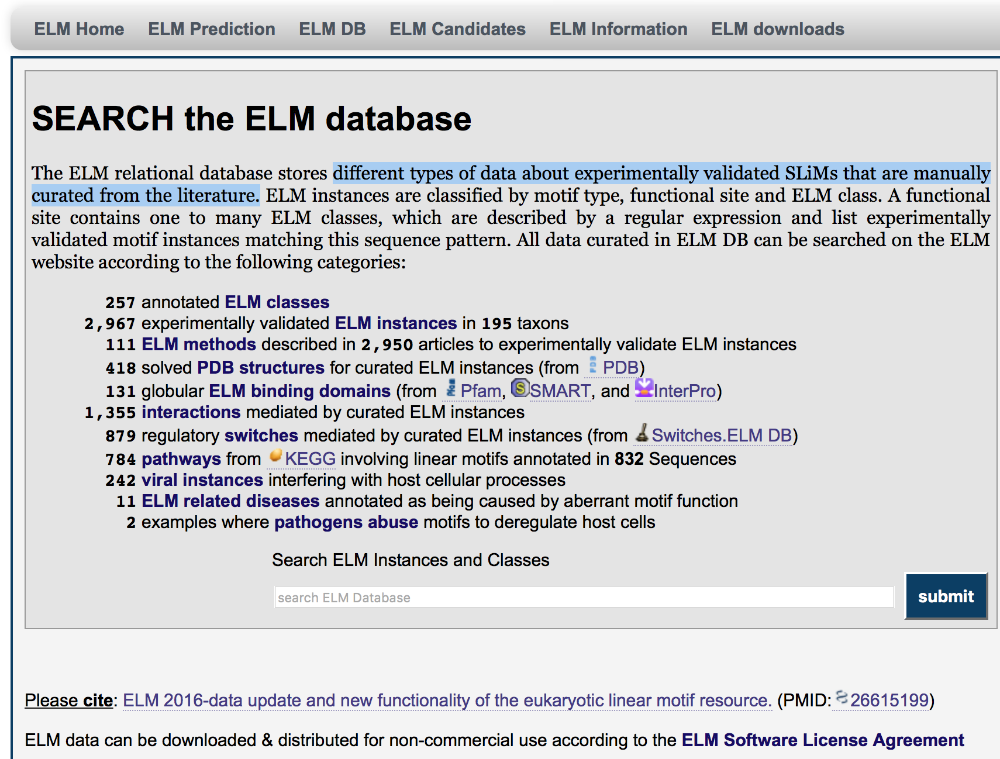
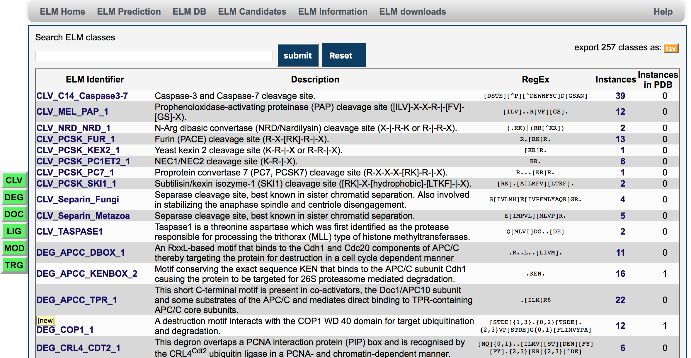
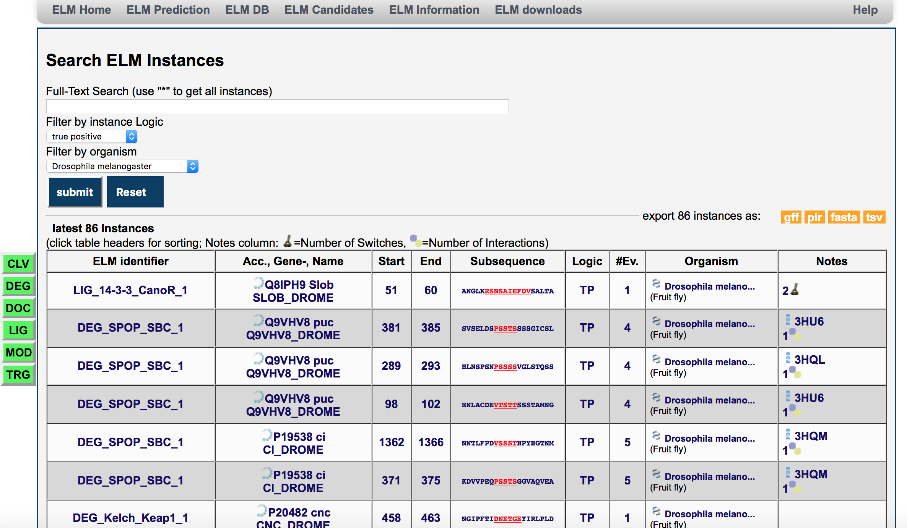
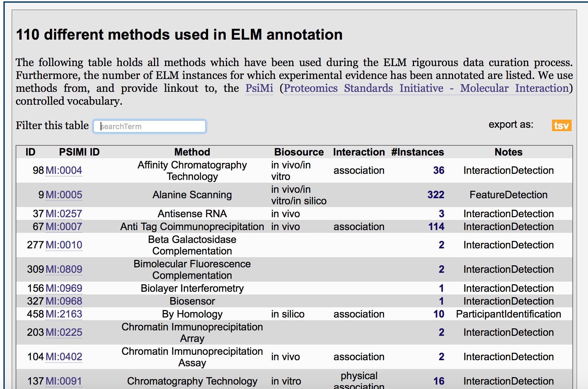
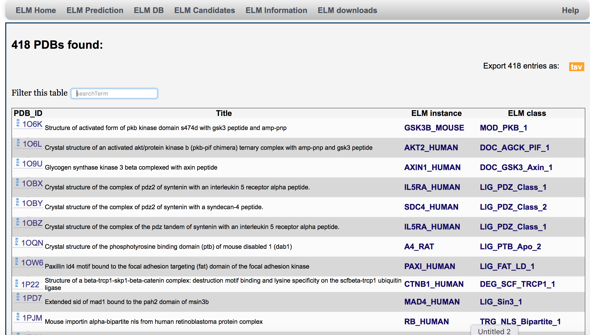
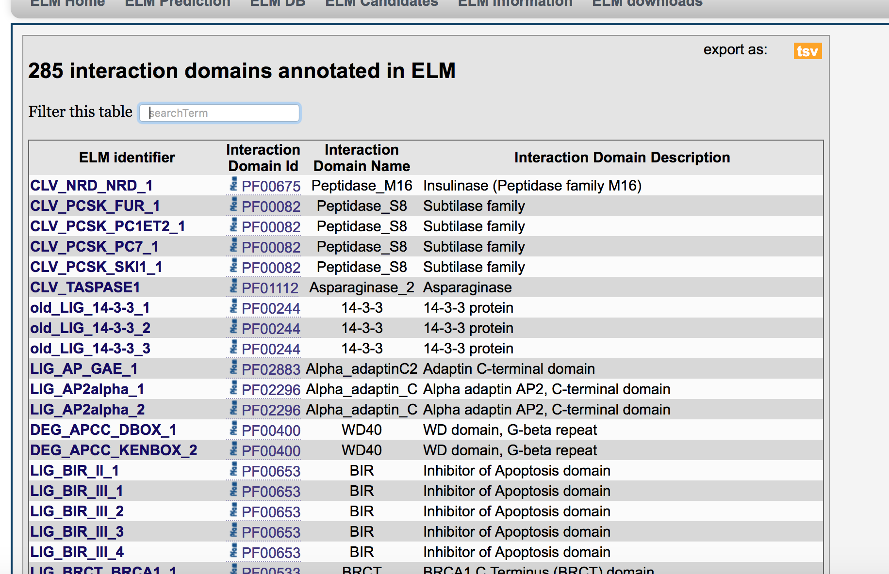
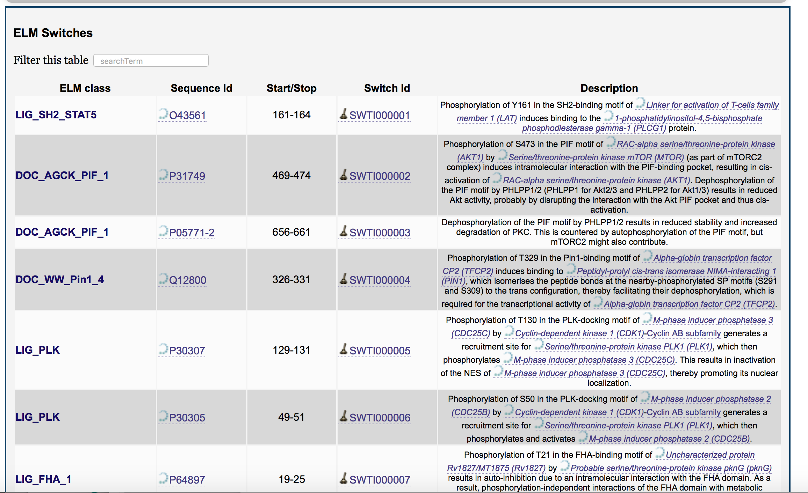
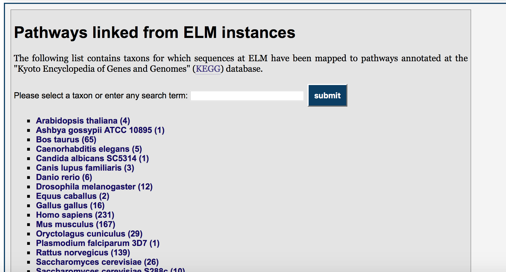
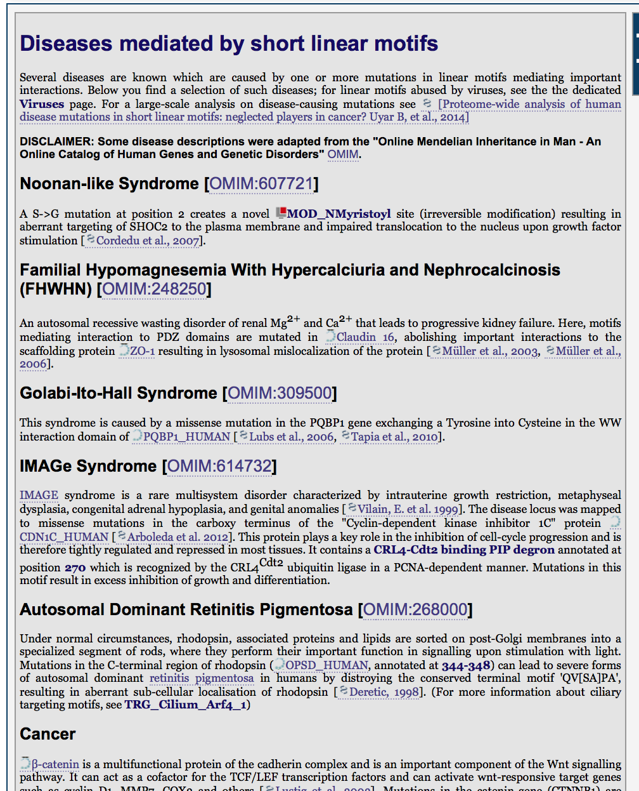

# Basic protocol 2: Explore the content of the ELM DB

The core of the ELM database is the set of manual annotations of motifs and
instances curated from literature. There are over 3000 annotated instances from
XXX classes from YYY publications. In this protocol we give an overview on how
to navigate and browse the entire database content. This section should give an
overview of all the data, and types of data contained in the database.

## Database content overview

**Figure TP53-BP2-1** The ELM database overview page (elm.eu.org/search.db).

Step 1. Go to the http://elm.eu.org and click on the tab "ELM DB" to explore the
content of the different types of data about experimentally validated ELMs that
were manually curated from the literature (Figure TP53-BP2-1). This page
contains a brief summary of the database content, as well as the number of
links to third-party databases.

**Figure TP53-BP2-2** The list of all motifs in the ELM database.

step 2. Click on the sub-menu "ELM classes" in "ELM DB" to go the page with all
of the ELM classes (Figure TP53-BP2-2).  For each class, the following
information is provided: ELM identifier, short description, regular
expression, number of instances annotated for each class, and number of
structure available. For details on each class, click on the ELM
identifier.

> Use the search bar at the top of the page to filter for certain motif
> classes. For example, typing "MAPK" and hitting submit will limit the set of
> results to motifs wich contain "MAPK" in the name or in the short description
> (right?). The green buttons on the left can also be used to filter this
> table. For example, toggling the "DOC" button will remove all "DOC" classes
> from the table (and clicking it again will bring them back). Lastly, the
> yellow tsv link can be used to export all motif classes as a "tab separated
> values" file.

**Figure TP53-BP2-3** The list of all instances in the ELM database.

step 3. Click on the sub-menu "ELM instance" in "ELM DB" to go to 
the page which lists all of the instances in the database (Figure TP53-BP2-3).
This table contains a list of all instances in the database (in the same format
as step XXXX, figure YYY in the previous section).

> Use the search filters at the top of the page to limit the results by a
> full text search, by instance logic, or organisms. Similar to the ELM classes
> page (previous step) these results can be filtered by motif class using the
> green toggle filters on the left hand side. Lastly, the yellow buttons at the
> top of the page can be used to download the instances in 1 of 4 formats: gff,
> pir, fasta or tsv.

**Figure TP53-BP2-4** The list of all methods used in the ELM database.

step 4. Click on the sub-menu "ELM methods " in "ELM DB" to go to see a list
of all methods which have been used to identify motifs and instances (figure
TP32-BP2-4). This table shows the internal method identifier in the first
column, and a link to the corresponding entry in the PSIMI database (REF), as
well as some more details in the rest of the table (???).
Clicking on the link in the "instances" column will list all instances
annotated using that method.

> The filter bar on the top page can be used to filter the list of methods. The
> *tsv* link creates a downloadable file in "tab separated values" format.

**Figure TP53-BP2-5** The list of all known structures in PDB also in ELM.

step 5. Click on the sub-menu "ELM pdb structures" in "ELM DB" to go to see a
list of all solved structures ??? (Figure TP53-BP2-5) Which structures do we
actually have? whole proteins? motifs? This page also contains links to each
instance and the motif class of that instance.

> The filter bar on the top page can be used to filter the list of structures
> shown . The *tsv* link creates a downloadable file in "tab separated
> values" format. The *tsv* file contains the PDB id, uniprot name, and ELM class. 

**Figure TP53-BP2-6** A list of all interactions annotated in the database.

step 6. Click on the sub-menu "ELM binding domains " in "ELM DB" to go to see a
complete list of all the interaction domains in ELM (Figure TP53-BP2-6).
This table shows the ELM classes which have been annotated as having an
interaction. This table shows the ELM class, a link to the domain on Pfam, as
well as the name of the interacting domain and a brief description.

> The filter bar on the top page can be used to filter the list of interactions
> shown. The *tsv* link creates a downloadable file in "tab separated
> values" format.

## Links to external resources

**Figure TP53-BP2-7** A list of all switches annotated in ELM.

step 7. Click on the sub-menu "ELM switches" in "ELM DB" to see a
complete list of all the switches in ELM (Figure TP53-BP2-7). This table shows
the motif class, contains a link to Uniprot, and the start and stop positions of
the motif mediating the switch. The last two columns have links to switches.ELM, and a brief
description of the switch also taken from switches.ELM (PMID:23550212).

> The filter bar on the top page can be used to filter the list of interactions
> shown. 

**Figure TP53-BP2-8** A list of all Pathways from KEGG with proteins in ELM.

step 8. Click on the sub-menu "ELM pathways" in "ELM DB" to go to see a list of
all pathways contained in ELM (Fig. TP53-BP2-8). Pathways are from the "Kyoto
Encyclopedia of Genes and Genomes" (KEGG) database mapped to ELM instances.
Click on a species (for example "Homo sapiens") for a complete list of all Human
pathways which have a protein annotated in ELM, and links to the pathways on KEGG.

## Infections and Diseases

**Figure TP53-BP2-9** A Table of the ELM instance abused by viruses 

step 9. Click on the sub-menu "ELM virus instances" in "ELM DB" to see a
list of all instances in ELM that have been annotated as being abused by
viruses (Fig TP53-BP2-9). The columns are identical to those listed in section
XXX step YYY (Figure ZZZZ).

> The green buttons on the left can be used to filter this
> table by motif class. Click on the yellow links on the top right of the page
> to download the (complete) table in giff, pir, fasta or tsv format. (See
> section XXX for a description of these formats.)

**Figure TP53-BP2-10** A list of all diseases in ELM. 

Short description of disease caused by mutation reported in ELM instances. (Fig TP53-BP2-10)
step 10. Click on the sub-menu "ELM diseases" in "ELM DB" to go to see a list
of all motif classes that have been annotated with a disease. Disease
information is taken from the OMIM database.

> This table also includes the diseases found under the "ELM pathogenic
> abuse" menu in "ELM DB". (right?)
