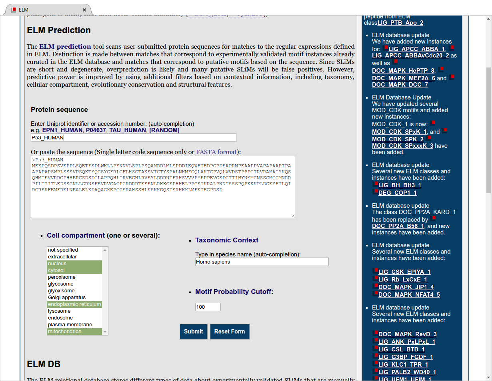

# Basic Protocol 2: Predicting ELMs in sequences

In this protocol we will be viewing the manually annotated data of a typical
protein, using p53 (Uniprot ID: P53_HUMAN/P04637) as an example. We will cover how to
find the manually annotated motifs and instances, and how to find the motif
instances, the references used to annotate each instance, the experimental
protocols used, and additional information including relationships to biological
pathways (such as KEGG PMID:26476454), diseases (from OMIM PMID:17357067) and
molecular switches (in switches.ELM PMID:23550212).

## Necessary Resources

### Software & Hardware

A modern browser such as Firefox, Chrome, or Safari.
ELM is best viewed on a laptop or desktop computer, although tablets and
smartphones will also work.

## Searching ELM database content

**Figure TP53-BP1-1** The query input page for ELM for predicting motifs in a given protein sequence.

Step 1. Open a browser, and navigate to the ELM homepage: http://elm.eu.org.
Enter the Uniprot ID "P53_HUMAN" in the search field labelled "Enter a uniprot
identifier or accession number". The page should autocomplete/suggest the
protein "P53_HUMAN / P04637 (Homo sapiens)". Click on this entry to confirm
that we want to search for SLiM data for this protein. Click on "Submit" to
view the motif instance data for p53. (Fig. TP53-BP1-1)

> The autocompletion mechanism queries uniprot.org for protein identifier;
> if it succeeds, then additional information from uniprot
> will be used to pre-populate the filter boxes. In this example,
> P53_HUMAN is recognized as a Human protein, and so "Homo sapiens" is
> automatically filled in the "Taxonomic Contenct" field. Also, P53 has manually
> annotated motifs identified in the nucleus, cytosol, endoplasmic reticulum
> and mitochondrion, so these are also automatically applied as search
> criteria. The motif cutoff of "100" is a sufficiently high (lenient) threshold
> to allow all other detected motifs to be shown.

## Browsing annotation details.

**Figure TP53-BP1-2**

Step 2. The results from the query will open in a new tab (Fig. TP53-BP1-2).
Note that not all motif hits are
shown: the image is chopped off at the bottom. The protein has a handful of
structural features (shown in the top 5 rows). See the legend at the top of the
figure for more information. Motif instances which are manually annotated in
the database appear as red or yellow ovals in the graphic. Blue/gray squares
represent predicted motif occurrences (which are further discussed in Basic
Protocol 3: Predicting ELMs in sequences)

**Figure TP53-BP1- 3**

Step 3. On the results page, scroll down to the heading: "The ELMs in the
following table are known instances annotated from the literature" (Fig TP53-BP1-3).
This table has details of SLiMs which have been manually annotated in the ELM
database. The columns show each motif name, the sequence(s) that matched the
motif as well as their starting and ending positions and the logic of the annotation
followed by a short description of each motif, to which cell compartments its
has been associated, and finally the regular expression of the motif.

> The "Logic" column indicates whether this motif is an example of a functional
> (True Positive, TP) or non-functional (False Positive, FP) motif. A TP
> instance is an instance annotated with experimental evidence showing this
> instance to be functional, whereas a FP is an instance with experimental
> evidence hinting at a function, but after careful inspection our annotators
> believe this instance to be non-functional. There are only rare cases of a
> true negative (TN) instance, which is an annotated instance where experiments
> have shown it to be non-functional.

