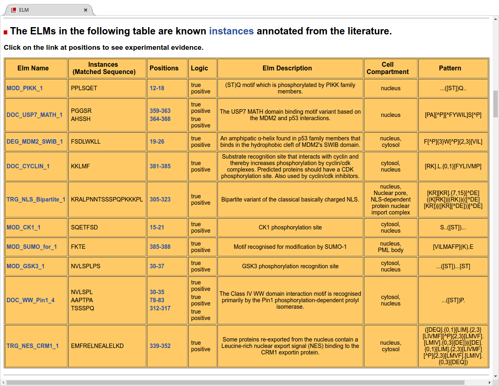

# Basic protocol 1: explore the manually curated information for the p53 protein in the ELM DB

The core of the ELM database is a repository of manually annotated
motifs and instances. As of December 2016, ELM contains over 260 motif classes
categorized into 6 different types: DOC (docking), LIG (Ligand binding), DEG
(degradation), CLV (cleavage), MOD (post translational modifications), and
TRG (targeting/anchoring) motifs (Figure functional_classification_of_SLiMs). These motifs are derived from various types
of experiments reported in literature. Each manually annotated motif also has a
set of bona fide instances (occurrences) of this motif. The motifs and motif
instances have been uploaded by a large group of annotators from around the
globe. The complete catalogue of manually curated data can be searched, browsed
and explored on the ELM website

In this protocol we will be viewing the manually annotated data of a typical
protein, using p53 (Uniprot ID: P53_HUMAN/P04637) as an example. We will cover how to
find the manually annotated motifs and instances, and how to find the motif
instances, the references used to annotate each instance, the experimental
protocols used, and additional information including relationships to biological
pathways (such as KEGG PMID:26476454), diseases (from OMIM PMID:17357067) and molecular switches (in switches.ELM PMID:23550212).

## Necessary Resources

### Software & Hardware

A modern browser such as Firefox, Chrome, or Safari.
ELM is best viewed on a laptop or desktop computer, although tablets and
smartphones will also work.

## Searching ELM database content

**Figure TP53-BP1-1** The query input page for ELM for predicting motifs in a given protein sequence.

Step 1. Open a browser, and navigate to the ELM homepage: http://elm.eu.org.
Enter the Uniprot ID "P53_HUMAN" in the search field labelled "Enter a uniprot
identifier or accession number". The page should autocomplete/suggest the
protein "P53_HUMAN / P04637 (Homo sapiens)". Click on this entry to confirm
that we want to search for SLiM data for this protein. Click on "Submit" to
view the motif instance data for p53. (Fig. TP53-BP1-1)

> The autocompletion mechanism queries uniprot.org for protein identifier;
> if it succeeds, then additional information from uniprot
> will be used to pre-populate the filter boxes. In this example,
> P53_HUMAN is recognized as a Human protein, and so "Homo sapiens" is
> automatically filled in the "Taxonomic Contenct" field. Also, P53 has manually
> annotated motifs identified in the nucleus, cytosol, endoplasmic reticulum
> and mitochondrion, so these are also automatically applied as search
> criteria. The motif cutoff of "100" is a sufficiently high (lenient) threshold
> to allow all other detected motifs to be shown.

## Browsing annotation details. 

**Figure TP53-BP1-2**

Step 2. The results from the query will open in a new tab (Fig. TP53-BP1-2).
Note that not all motif hits are
shown: the image is chopped off at the bottom. The protein has a handful of
structural features (shown in the top 5 rows). See the legend at the top of the
figure for more information. Motif instances which are manually annotated in
the database appear as red or yellow ovals in the graphic. Blue/gray squares
represent predicted motif occurrences (which are further discussed in Basic
Protocol 3: Predicting ELMs in sequences)

**Figure TP53-BP1- 3**

Step 3. On the results page, scroll down to the heading: "The ELMs in the
following table are known instances annotated from the literature" (Fig TP53-BP1-3).
This table has details of SLiMs which have been manually annotated in the ELM
database. The columns show each motif name, the sequence(s) that matched the
motif as well as their starting and ending positions and the logic of the annotation
followed by a short description of each motif, to which cell compartments its
has been associated, and finally the regular expression of the motif.

> The "Logic" column indicates whether this motif is an example of a functional
> (True Positive, TP) or non-functional (False Positive, FP) motif. A TP
> instance is an instance annotated with experimental evidence showing this
> instance to be functional, whereas a FP is an instance with experimental
> evidence hinting at a function, but after careful inspection our annotators
> believe this instance to be non-functional. There are only rare cases of a
> true negative (TN) instance, which is an annotated instance where experiments
> have shown it to be non-functional.

## Browsing Motif information.

**Figure TP53-BP1- 4** The motif details page for "DOC_CYCLIN_1". This page
contains all of the manual annotation details for the DOC_CYCLIN_1 motif,
the biological background summarized from the scientific literature including
links to the primary literature and to external resources (Pubmed (PMID:27899561),
GeneOntology (PMID:27899567), PDB (PMID:12037327) and more).

Step 4.  Click on "DOC_CYCLIN_1" to navigate to the page with details about the
"DOC_CYCLIN_1" motif (Fig TP53-BP1-4). This page contains a description of the
functional site class (a Cyclin recognition site), and a short description of
the ELM and its regular expression, as well as a probability score, the
taxonomic distribution of the motif and which domain (if any) is responsible
for the interaction.

> The probability score is the probability that the regular expression
> represents a random selection of amino acids (similar to an information
> content score). A lower score indicates that the motif pattern is more 
> difficult to find by chance in a random sequence.

Step 5. Scroll further down the "DOC_CYCLIN_1" page (Fig TP53-BP1-5) to view
more details about the manually annotated data and instances in the database
(to the text box starting with the "Abstract"). The "abstract" contains a more
detailed description of the motif annotation. Click on the "Show" button next
to the "selected references" header for a list of publications relevant to this
motif. Click on "Show" next to "GO terms" for a complete list of all GO terms
annotated for this motif.

Step 6. Scroll further down the "DOC_CYCLIN_1" page (Fig TP53-BP1-5) to view
the "Instances" header. This table contains the list of all annotated
instances in the database of this motif. This includes the protein identifier,
the start and end positions of the instance, the specific sequence matching the
regular expression and the logic of the instance. The "# Ev." indicates the
number of experimental evidences associated with the annotation (see section 
XXX below). Organism is the species in which the protein is found. Lastly the 
"Notes" column contains links to any "interactions" or "switches" present in the
database, as well as links to PDB if this structure exists in PDB.

## Browsing annotated instances

**Figure TP53-BP1- 5** The instance details page for the "DOC_CYCLIN_1"
instance found in P53 with start/end position "381-385".
This page also contains links to many external databases including Uniprot (PMID:25348405),
PDB (PMID:12037327), NCBI taxonomy, Pubmed (PMID:27899561), and KEGG Pathways (PMID:26476454), 
as well as the PSI-MI controlled vocabulary (PMID:17925023).

Step 7. Return to the P53 results summary page (Step 3) (by
hitting "back" in the browser), and scroll down the "instances" table.
To get information about the annotated motif instance of "DOC_CYCLIN_1"
(the third instance in Figure TP53-BP1-3) click on the link of its start/finish position
"381-385" to go to the instance details page of this instance. The top part of
the page contains details about the instance and the protein it was identified in.

Step 8. Scroll down to the "Instance Evidence" header to view details on the
experimental evidence used to annotate this instance. This table also contains
the "evidence class", and descriptions of the methods used from PSI-MI (PMID:17925023) as
well as the Literature references in which the experiments were published.

> (Here we should explain what "evidence class", "biosource", "Logic",
> "Reliability" and "Notes" actually mean).

## Details on molecular switches, motif-mediated pathways and other external resources.

Step 9. Scroll further down to the header "Pathways" to view pathway
information. This is a list of all of the pathways in which the protein p53 is
known to be involved (according to KEGG). Click on a pathway to see the 
localization of p53 in the corresponding KEGG pathway.

**Figure TP53-BP1-6** The instance details page for the "DOC_WW_Pin1_4"
instance found in P53 with start/end position "30-35". 

Step 10. Return to the P53 results summary page (Step 3) (by
hitting "back" in the browser), and scroll down the "instances" table in
Figure TP53-BP1-3. To get information about the first "DOC_WW_Pin1_4" motif,
click on the start/end position "30-35" (Fig TP53-BP1-6). This page is similar to
that described for P53 instance "DOC_CYCLIN_1" (Fig TP53-BP1-5); additionally, for this instance
there is information available about its interaction partner and a molecular switch
which is mediated by this motif instance.

Step 11. Scroll down to the "Interactions" header to view information about
this instance's interactions (Fig TP53-BP1-6). This instance interacts with PIN1_Human via the
"WW" domain (PFAM identifier PF00397; found on position 7--37 in PIN1_Human). If available, binding
affinities are also shown here. Interaction data is made available in Mitab and xml format (PMID:17925023).

Step 12. Scroll further down to the "Switches" section for a brief overview of
the switches details of this instance obtained form "switches.ELM" (PMID:23550212) (Fig TP53-BP1-6). This
particular instance is involved in the switch phosphorylating P53. Clicking
on the diagram will open an external link to the "switches.ELM" website.
