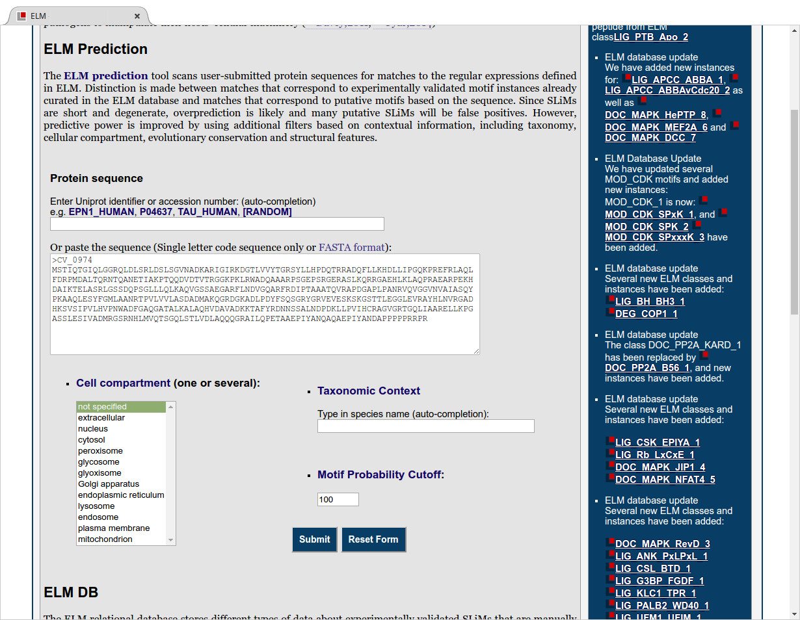

# Alternate Protocol 1: Predicting ELMs in sequences

TODO: DEDUPLICATE TEXT (COMPARE TO 4-P53_BASIC_PROTOCOL_2.MD)

TODO: DESCRIBE MOST PROBABLE MOTIF INSTANCES (COMPARED TO FILTERED)

We will use protein "CV_0974" (uniprot ID: Q7NZE8) as an example, a "probable
tyrosine phosphatase" from _Chromobacterium violaceum_. This protein is predicted
to be a tyrosine phosphates because it has a "tyrosine phosphatase" (PTPc) domain.

## Necessary Resources

### Software & Hardware

A modern browser such as Firefox, Chrome, Safari.
ELM is best viewed on a laptop or desktop computer, although tablets and
smartphones will also work.

## Submitting a query to ELM

**Figure BACT-BP-1:** The input query page for finding motifs in ELM. The
sequence for _C. vilaceum protein_ CV_0974 was used as an example for this
protocol.

step 1. Click on the "ELM Predictions" button in the menu to access the search query
   page (Fig. BACT-BP-1). Here you can provide either a protein accession (from
   uniprot) or an amino acid sequence (simply the
   sequence, or a FASTA formatted entry) in which you want to detect SLiMs.
   Retrieve the FASTA formatted sequence from Uniprot
   (http://www.uniprot.org/uniprot/Q7NZE8.fasta), and enter it into the "sequence
   input text box".

**Figure BACT-BP-2:** The graphical results summary of the ELM Prediction pipeline
for Probable Tyrosine phosphate (CV_0974). Note that not all motif
detections are shown (the image is truncated at the bottom). The top five rows show a handfull of 
structural features. The motif occurence are shown as blue boxes, the intensity of which
indicates the conservation score. See steps XXX to YYY for more information.

step 4. The Results are summarized in the first figure on the results page (see
   figure BACT-BP-2). The Graphical summary shows all of the final and
   intermediate results generated by the ELM Prediction pipeline, and can be
   used infer whether or not a motif is present in a sequence, as well as now
   likely it is to be functional based on its structural context and
   evolutionary conservation. 

step 5. The first row contains phosphorylation sites as retrieved from Phospho.ELM
   (PMID:21062810), and whether the phosphorylated amino acid is a serine, threonine
   or tyrosine. Phospho.ELM is a database of manually annotated phosphorylation
   sites obtained from scientific publications from low and high-throughput experiments. You can follow the link
   to Phospho.ELM by clicking on the phosphorylation site in the image.

> Phosphorylation sites are only available when the search is performed
> with a protein accession in step XXX.  Phosphorylation sites are relevant to
> interprete ELM motif predictions when
> the predicted motif requires to be phosphorylated (as in several docking and
> ligand binding motifs) and naturally, for the prediction of phosphorylation
> motifs.

step 6. The second row shows SMART and Pfam domains detected by the SMART
   database (PMID:9600884,PMID:25300481, PMID:9600884). Hover the mouse over these domains to
   see their names and exact start and end positions.

> In order to be functional SLiMs need to be accessble, and are therefore they
> are usually not found within domains and structured regions (PMID:21909575). Any
> SLiMs detected by the ELM prediction pipleline are less likely to be
> functional, and are filtered out by the "structural filter" (see also step XXX).

step 7.  The third row shows globular and disordered regions in the sequence as
    predicted by GlobPlot (PMID:12824398). The 4th & 5th
    rows contain results from IUPred (PMID:15955779), another unstructured region
    prediction tool. Protein segments with an IUpred score above 0.5 are 95% likely
    to be disorered (REF???).

>  SLiMs are typically only functional when found in intrinsically disordered
>  regions. Any motif occurence detected by the ELM prediction pipeline that
>  fall within disoredered regious are more likely to be functional.

step 10. Place the cursor over the blue box for motif occurence
   "DOC_USP7_MATH_1" at position 129-133. This motif is in a disorered region, and
   has not been filtered out by the structural filter. However, its
   conservation score is extremely low: 0.000, indicating it is not conserved
   in homologous proteins. Place the cursor over motif "DOC_MAPK_DCC_7" at
   positions "334-343". Despite the high conservation score (1.000), this motif
   is inside the PTPc domain (and a Globular regions), and therefore has been
   filtered out.

## Interpreting the prediction results: Additional Information

**Figure BACT-BP-3:** This section of the results contains additional details
of alignment of homologous proteins, filtering results and globular domains.

step 12. Scroll down to below the results graphic to find additional
   information on the ELM Predction pipeline's results (figure BACT-BP-3).
   The first section contains links to download or view the multiple sequence
   alignments of homologous proteins used to calculate the conservation score.
   Click on the link "Click here to enable the multiple sequence alignment
   viewer" to open the alignment in Jalview (note: this requires the Java browser
   plugin, which is not available on some newer operating systems).
   Alternatively you can also download the "alignment", "conservation features"
   and "phosphosite features" files separately to view on a standard
   (non-browser) installation of Jalview.

> The search for possible homologs is performed against the UniRef90
> database, a dataset of protein sequences with less than 90 percent identity
> between any two of them (PMID:25348405). It is also possible that 
> that the BLAST results are not finished when the results page is shown: We
> suggest to refresh the page if you see the message "Either not enough data
> available to calculate a sequence alignment or the calculations haven't
> finished yet". In some cases it is also possible that no homologs will be
> detected. If you have refreshed the page after waiting for more than 3
> minutes, this is most likely the case.

step 13. Scroll down to the section titled "Filtering Summary" to
   view some statistics about how many motifs and instances were filtered
   out (figure BACT-BP-3). The first two lines contain information on whether and which filters were
   applied in step XXX of this protocol. The next two lines (SMART & Structural
   score) show how many motifs and instances were removed by the SMART and
   Secondary structure filters. The "Retained by" section shows how many motif
   hits were not filtered out by the "Smart" or "Structural Score" filter. In
   this example a total of 156 instances (of 54 different motifs were
   identified), of which 63 instances (and 16 motifs) were filtered out as they
   occured in a SMART domain.

> Note that the graphical summary above does not contain sequences filtered
> out by the "cell compartment" and "taxonomic context" filters (in step XXX).
> However those filtered out by by the SMART and Structural scores are shown in the
> graphic above (as gray rectangles). If any "cell compartment" or "taxonomic
> context" filters are selected in step XXX, the number of motifs and instances
> are also shown in this table.

step 14. Scroll down to the section with the header "Globular domains/ TM
   domains and signal peptide detected by the SMART server" (Figure BACT-BP-3). This section
   contains information on which domains were detected by the SMART
   server, and their positions. Clicking on their names will bring you to the
   SMART entry for that domain on the SMART homepage.

**Figure BACT-BP-7:** This table contains the list of motifs detected in the
sequence (only the top part of the table is shown).

step 16. Scroll further down to the section title "Results of ELM motif
   search after globular domain filtering, structural filtering and context
   filtering" to obtain an overview of all of the motifs and motif instances
   detected (Figure BACT-BP-7). Each row also contains information on the Motif name, the matching
   peptide sequence and its position. Additional information is shown about the ELM, cell compartment and its regular
   expression. If the motif was detected in a homologue, the column called
   "PHI-Blast Instance mapping" contains links to the Sequence alignment of
   the homologous protein, and a summary of the ELM instance mapper output. If a
   motif instance has been filtered out due to Structural criteria (SMART or
   Structure), this column contains a link to a page with details on how
   individual criteria that make up this filter. The last column contains
   information on the Probability filter: the probability reflects the chance
   to observe this motif in any random amino acid sequence.

**Figure BACT-BP-8:** This table contains the list of motifs detected in the
sequence (only the top part of the table is shown) which were excluded due to
structural filters.

step 17. Scroll further down to the heading "List of excluded ELMs falling inside
   SMART/PFAM domains and/or scoring poorly with the structural filter (if
   applicable)." (Figure BACT-BP-8). This table is (almost) identical to the
   one above, but shows motif instances which were rejecte by the Structural
   filter or SMART filter.
