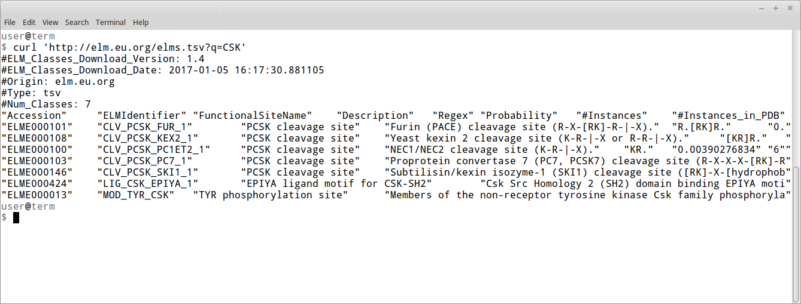
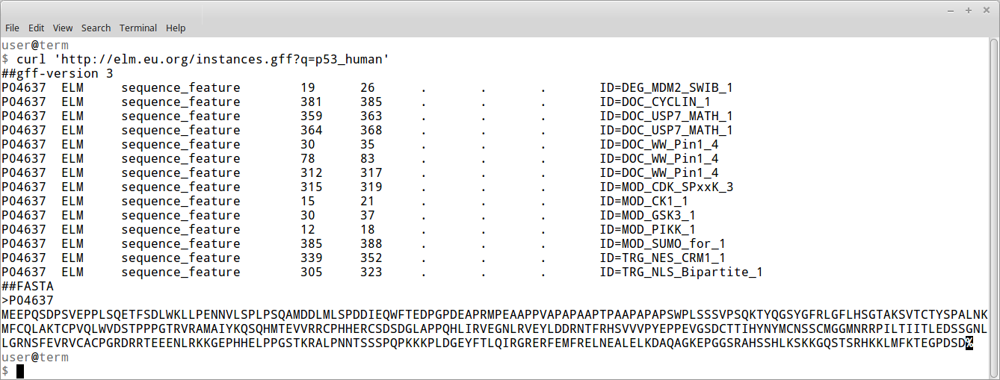

# Alternate Protocol 3: Searching the ELM database using REST API

All of the data in ELM is available to download so that anyone can also run
their analyses locally, on their own computer. In many cases it also is useful access data programatically, via an Application Programming Interface (API). ELM provies many features to query, search, filter and download data withouth having to use a browser.

In this section we will explore the various ways in which data can downloaded
both in using the browser as well as via the commandline. 

## Necessary Resources

### Software

Ideally use `curl` https://curl.haxx.se/ on the commandline. This program can
be launched from the terminal in any of the major operating systems: OSX,
Windows and Linux. Of course `curl` is only one of many different ways to
access web content programatically, and we suggest anyone to use which ever program they feel is better suited for their tasks.

## Downloading all ELM classes

**Figure ELM-Downloads:** The ELM downloads page, which holds information about
the different types of data (such as "Classes", "Instances", etc; see menu to
the right) that can be obtained from the server. The orange boxes are clickable
links, the URL following them are used to highlight the URL scheme used by the
server (bold font denotes specifics used in the examples such as query terms,
or formats).

step 1. Direct your browser to the URL 'http://elm.eu.org/downloads' or select 
'ELM Downloads' from the main Menu (Figure ELM-Downloads) This webpage contains
links and descriptions on how to download ELM data in text format. The
datasets are split into several smaller collections (for example
"Classes", "Instances", etc). Each table contains links (in orange) to download
the data in various formats.

> Each table also shows the 'last modified date' indicating when the data was last updated. This is useful if you want to know when to update your local data with the most up to date ELM data.

step 2. Click on the first orange 'html' link in the table "Classes" to
navigate to the following URL: 'http://elm.eu.org/elms/elm_index.html'. This
page shows all of the annotated ELM classes in the database. This page is
the same one as shown in Figure *TP53-BP1-classses*

step 3. Navidate to the folling URL: 'http://elm.eu.org/elms.html?q=CSK',
specifying "q=CSK" to limit the list of ELMs to those matching the search query
"CSK". This page is again similar to the one shown in Figure
*TP53-BP1-classses*, but with less classes.

> This search result is identical to the result you would obtain by doing a
> "manual" search on the ELM Classes page (http://elm.eu.org/elms.html). The
> column descriptions are also the same as described in Step XXX in Protocol
> YYY.

**Figure ELM-Curl-Classes**:
Screenshot of a terminal window using `curl` to download all ELM classes matching the term 'CSK'.

step 4. Open the following URL: 'http://elm.eu.org/elms.tsv?q=CSK' to download
a list of classes that match the search query "CSK" (as in the previous step)
in the "tab separated values" format.  By exchanging the '.html' part of the
url with '.tsv', we ask the webserver to give us the data in TSV
(tab-separated values) format.

> Depending on which browser you are using, the file may open directly in your
> browser, or you may be prompted to download the file or save it to a separate
> location. In the latter two cases you can open the downloaded file using a
> (plain) text file viewer, or possible a spreadsheet viewer (such as Microsoft
> Excel). 

step 5. Type the follwing command into a command line terminal to download the
same data from the previous step directly into the terminal: `curl
'http://elm.eu.org/elms/elms_index.tsv?q=CSK'`. The output should look similar
to *Figure ELM-Curl-Classes*. The column names are still the same ones as shown
in the _classes_ table in Figure *BACT-AP2-Elm-classes-downloads*.

> Use the curl option `-o` to save the results directly to a file. For example: 
> `curl -o classes.tsv 'http://elm.eu.org/elms/elms_index.tsv?q=CSK'` will save
> the data to a file called _classes.tsv_.

step 6: To download a list of all motif instances detected in Human P53, type
the followin command into a terminal: `curl
'http://elm.eu.org/instances.gff?q=p53_human'`. The output should look similar
to that shown in figure *Figure ELM-Curl-P53*. The output is in the "General
Feature Format" (http://www.ensembl.org/info/website/upload/gff.html#moreinfo),
with the FASTA formatted sequence appended to the end of the output.

> Many other file formats are available for downloading instances annotations,
> including the FASTA, GFF, PIR, or PSI-MI format (either XML or MiTab)
> [24067240]. 

**Figure ELM-Curl-Instances-P53**:
Screenshot of a terminal window using `curl` to download all ELM instances
annotated for sequence p53_human.

step 7. To download a list of all instances matchin th search query "CLV" in
the yellow fever mosquito (Aedes agypti), enter the following command into a
terminal: `curl 'http://elm.eu.org/instances.tsv?q=CLV&taxon=aedes+aegypti'. In
general any species name can be used, always replacing the "space" with a "+".
This should return a single instance, the only one matching CLV in A. aegypti.

step 8. More data (interactions, domains, methods, etc.) can be downloaded from
ELM in analogous fashion as shown in the preceeding steps. Take a look at the
ELM Downloads page (http://elm.eu.org/downloads, Figure
*BACT-AP2-Elm-downloads*) for an overview of which datasets can be downloaded,
and what the different possible filters and formats are for each dataset.

% NOTE: TODO: Mention ELM software license agreement?
