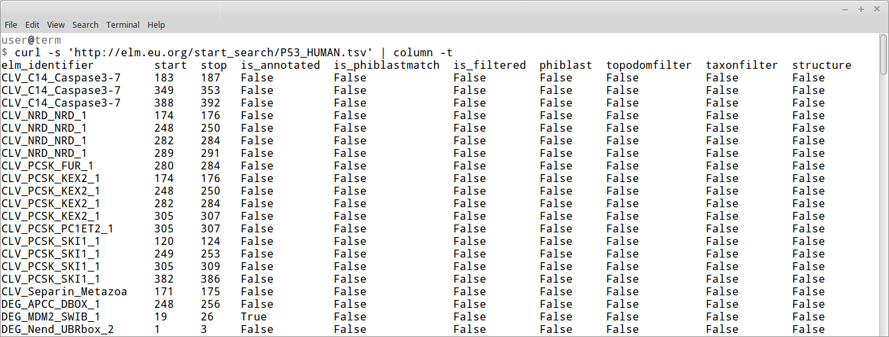
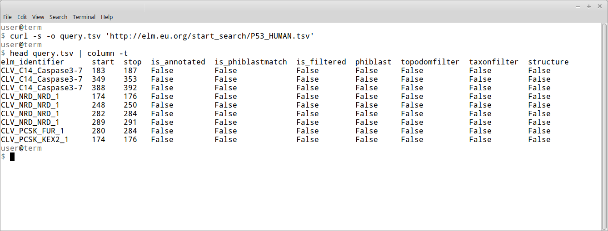

# Alternate Protocol 4: Predicting ELMS in sequences using REST API

Querying ELM for motifs in a given sequence (as discussed in basic protocol 1),
gives you a nice overview of putative and possibly annotated motifs in your
query protein with a graphical representation using colors to highlight
different regions of the protein sequence (eg. disordered vs. globular).
It is however difficult to analyse a large set of protein sequences in this
manner. Therefore, http://elm.eu.org provides an interface which you can use to
submit your sequence in a programmatic way. Of course, this way, you won't
receive the graphical output representation, but are limited to textual data
representation.

Currently, there exists a single URL 'http://elm.eu.org/start_search/' to
accept such queries. You can choose to either submit a uniprot name or accession
(ex. 'http://elm.eu.org/start_search/P53_HUMAN.tsv') or submit your raw
sequence (ex. 'http://elm.eu.org/start_search/MAPRGFSCLLLLTSEIDLPVKRRA').

The logic here is, if the URL ends in '.tsv' then the server assumes you
are using a Uniprot id or accession; if it doesn't, then it assumes you are
using raw sequence. See below for details.

## Necessary Resources

### Software

Ideally use `curl` https://curl.haxx.se/ on the command line. This program can
be launched from the terminal in any of the major operating systems: OSX,
Windows and Linux. Of course `curl` is only one of many different ways to
access web content programatically, and we suggest anyone to use which ever
program they feel is better suited for their tasks.

## Submitting a query to ELM via REST

step 1. Use `curl` to query ELM for all motifs predicted to occur in Human P53
by typing the following into a terminal: `curl
'http://elm.eu.org/start_search/P53_HUMAN.tsv'. Each row represents a motif
detection, and the first column "elm_identifier" indicates which class was
identified. The columns "start" and "stop" show that first and last amino acid
positions that matched form part of the motif. "is annotated" is True if this
motif has been annotated in the database as an (experimentally validate) motif
instance. "is phiblastmatch" is True if ?????. The column "is filtered" shows
whether or not this motif was rejected by the ELM Prediction structure filter.
"phibast" indicates whether ?????. The "topodomfilter" and "taxonfilter" shown
whether ?????. The last column "structure" ?????

> In Figure *ELM predictions pP53* we used a sligtly more advanced command to
> get the output to look nice in the terminal. We specified the `-s`
> option to silence all `curl` output other than the downloaded file, and piped
> (`|`) the output directly to the `column` command (this command exists on
> most Linux and OSX machines).

TODO: REDO FIGURE as it shows browser in transparent background 

**Figure ELM Predictions P53:** The commandline output when `curl` is used to
donload all motifs predicted in Human P53. Note that we used a more advanced
command that `curl` alone to make the columns align nicely (see text for an
explanation).

step 2. Use `curl` to query ELM via protein sequence by using the URL
'http://elm.eu.org/start_search/MAPRGFSCLLLLTSEIDLPVKRRA' (Figure
BACT-AP3-query). In this case the the query is an arbitrary short peptide
sequence, but this can (of course) contain any sequence you are intersted in
analysing. The output format is exactly the same as in the previous step. 

> This way of querying ELM is unfornataly not stable for long protein
> sequences. Different browsers and computers have different maximum lengths
> for URLs, and the excess text is often simply ignored. We reccomend not using
> this method for sequences longer than 2000 amino acids.

TODO: REDO FIGURE as it shows browser in transparent background 

**Figure ELM Predictions on query sequence:** It is also possible to send amino
acid sequences to the ELM Prediction pipeline. In this case we have used the
curl option `-o` to download directly to the file `query.tsv`, and use a
combination of the `head` and `column` commands to display the first 10 rows to
the terminal.

TODO: add this information to the download page

TODO: maybe rename `start_search` to `query`?
