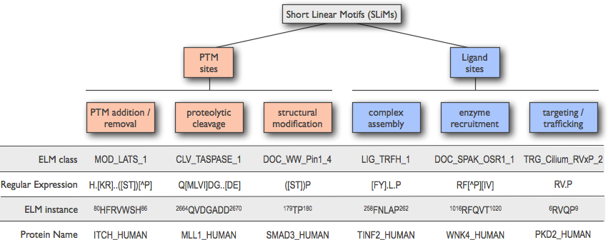

# Commentary: 

*instructions: A brief discussion of the theory and applications of your*

## Background Information

**Im still not sure what's going to happen here :(**

In order to interpret the data contained in ELM and the results produced by the
ELM prediction tool, it is important to have a basic understanding of SLiM's
and how they are affected by their structural and biological context.

Taking into account additional information, besides a match to a sequence
pattern defining a SLiM, can greatly narrow the selection of putative motifs
for experimental validation. 

SLiM's operate via with interactions with other proteins, typically the surface
of a globular, domain in a protein, although some are known to bind to
disordered regions. As their name suggests, SLiMs are compact, being composed
of a limited number of adjacent amino acids. Most of a motif’s binding
specificity however is conferred by only a subset of these amino acids. Those
few residues that directly interact with the binding partner are evolutionary
conserved, although in many cases a subset of amino acids that share certain
properties (such as similar charge, size or hydrophobicity) are allowed in
these hotspot positions. In the motif positions that contribute little to the
interaction, there are even less constraints, i.e. a broader range of amino
acids is allowed in these positions (PMID:21909575).
A first consequence of this degeneracy is that SLiMs co-operatively engage in
interactions of relatively low affinity. 
Hence these binding events are transient and reversible, and can be readily
modulated, for instance by PTM. 

**Figure functional_classification_of_SLiMs** For each ELM class, the
functional category to which it belongs is indicated by a three-letter prefix.
Each ELM class is defined by a regular expression. Peptide sequences in
proteins that match the regular expression of a specific ELM class and that
were experimentally validated to be functional motifs are captured as ELM
instances of that class. Degrons are a specific subtype of enzyme-recruiting
docking motifs (see text for a detailed description).

## Critical Parameters and Troubleshooting

*instructions: optionally 2 separate sections.*

