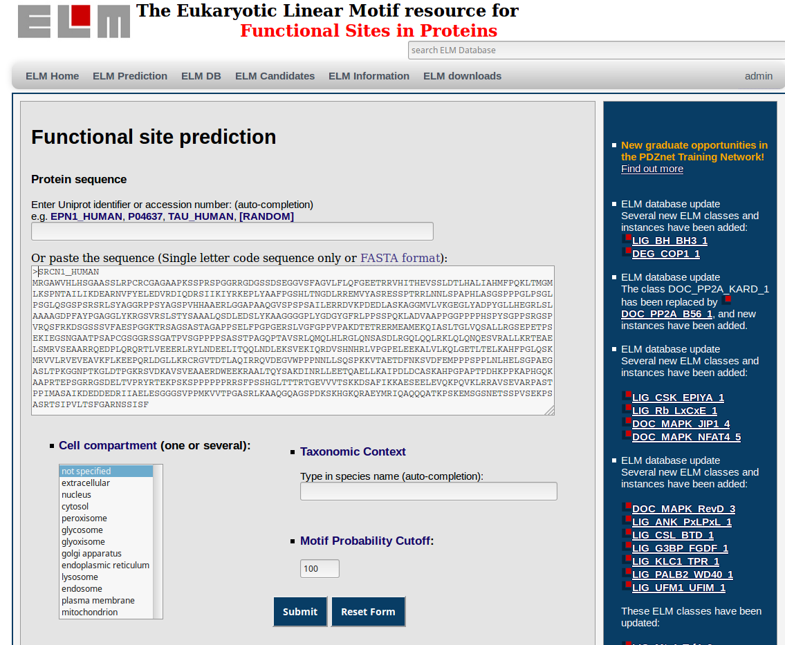
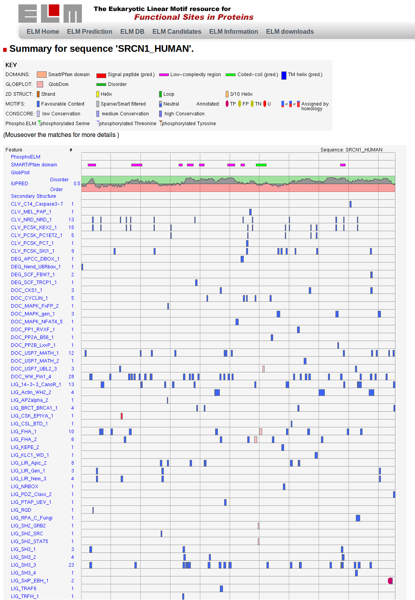
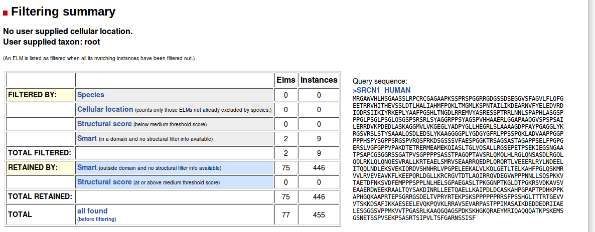
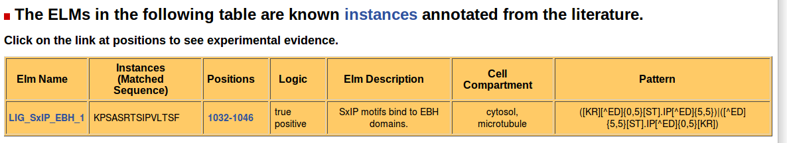
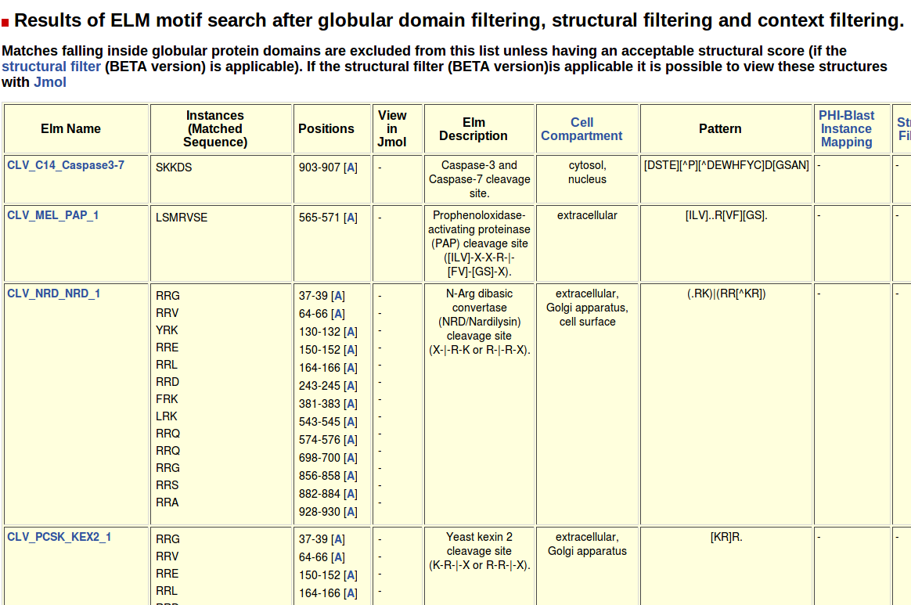
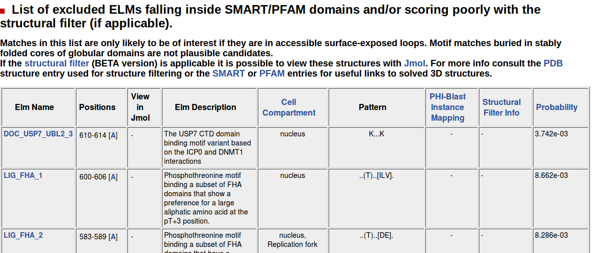
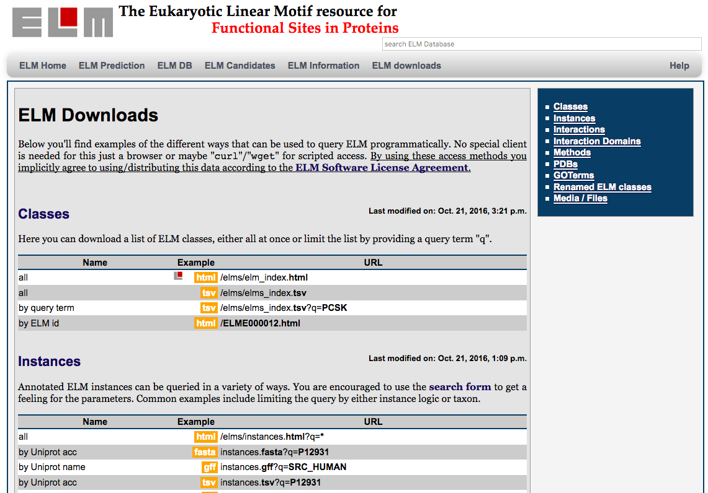

# Abstract

*instructions: brief overview, no references, max 150 words*

# Introduction

*instructions: gives context in relation to chapter; short description of
individual protocols in unit; a brief mention of any critical limitations and
assumptions;*

The activity and function of a protein is tightly regulated by its cellular environment. To interact with their surroundings, proteins use various types of binding modules that each display distinct binding properties (PMID:10550212). One prominent type of binding module consists of short linear motifs (SLiMs) (PMID:18508681). These compact binding sites mediate a diverse set of interactions that regulate protein functionality (PMID:24926813) (Figure 1). They can function as ligand binding sites or as sites for post-translational modification (PTM). Some ligand SLiMs are recognised by components of the cellular transport machinery and function as localisation signals that target proteins to specific sub-cellular compartments. Other ligand SLiMs are abundantly present in interfaces that mediate the assembly of large macromolecular complexes and in highly modular scaffold proteins that act as multivalent platforms for protein complex assembly. Docking motifs are ligand SLiMs that recruit modification enzymes to their substrates by binding to a site on the enzyme that is distinct from the active site. A subset of these, known as degrons, recruit ubiquitin ligases, which subsequently polyubiquitylate their substrates and hence target them for proteasomal degradation. SLiMs that act as sites for PTM can either be targeted by specific enzymes for the addition or removal of a small chemical group, mediate proteolytic cleavage by acting as target site for proteolytic enzymes, or be recognised for structural modification by isomerases that catalyse cis-trans isomerisation of the peptide backbone.

SLiMs are generally located in intrinsically disordered regions (IDR) of the proteome, but often adapt a secondary structure upon binding (PMID:19841628). In general, they bind to the surface of a globular domain in a protein, although some are known to bind to a protein’s IDR or even RNA molecules. As their name suggests, SLiMs are compact, being composed of a limited number of adjacent amino acids. Most of a motif’s binding specificity however is conferred by only a subset of these amino acids. Those few residues that directly interact with the binding partner are evolutionary conserved, although in many cases a subset of amino acids that share certain properties (such as similar charge, size or hydrophobicity) are allowed in these hotspot positions. In the motif positions that contribute little to the interaction, there are even less constraints, i.e. a broader range of amino acids is allowed in these positions (PMID:21909575). A first consequence of this degeneracy is that SLiMs co-operatively engage in interactions of relatively low affinity. Hence these binding events are transient and reversible, and can be readily modulated, for instance by PTM. These characteristics make SLiM-based interactions ideal mediators of the dynamic processes involved in cell signalling (PMID:22480932). Another consequence is that it might take only a few or even a single point mutation to generate or disrupt a functional motif in a protein. The associated ability to evolve convergently might underlie the proliferation of SLiMs and the rewiring of interactomes (PMID:26589632) (PMID:22346764). Conversely, several SLiM-associated diseases have been characterised to date, for instance Liddle syndrome (PMID:15483078).

Due to their degenerate nature, motif sequences contain only very little information, and many short sequences in a proteome will match motif patterns. However, most of these matches will not represent functional motifs, and hence, when scanning a proteome for putative motifs using only the motif sequence patterns will yield a large number of false positive instances, far exceeding the number of true motifs. Therefore, reliable motif detection cannot go without experimental validation of candidate motifs, using different types of experiments and techniques (PMID:26581338). This however does not mean that bioinformatics analysis cannot guide researchers towards a subset of candidate motifs that have a higher probability to be functional and help rule out those candidate motifs that are likely to be false positives. Taking into account additional information, besides a match to a sequence pattern defining a SLiM, can greatly narrow the selection of putative motifs for experimental validation. Additional data for in silico analysis include conservation of the motif sequence, the location of the motif within the protein’s structure and its accessibility for its binding partner, validated interaction with the binding partner, and in-cell co-localisation with the binding partner. The availability and usefulness of these additional data for SLiM discovery depends on their extensive and correct biocuration. A vast and increasing amount of biological data is available in a wide variety of sources, including the literature and large-scale datasets. In order to facilitate integration of data, they need to be collected, annotated and formatted in central data and knowledge repositories. The ELM database provides such a repository for experimentally validated linear motif classes and instances. The ELM prediction tool in turn relies on annotated data, both from the ELM database and other resources, to accurately analyse unknown sequences for candidate motifs and assist researchers in selecting the most plausible ones for experimental validation and discard likely false positive hits, saving them valuable time and assets (PMID:22110040).

# Basic Protocol 1: Searching & Browsing the ELM database

*(introduction goes here)*

## Necessary Resources

### Software

## (First subheading goes here)

step 1. (First step goes here)

step 2. (goes here)

*note: please start leave the word 'step' in the step. This is needed for
gitlab to not auto-renumerate the numbers.*

*instructions: write steps in numerical order (1,2,3... etc), separated by
logical subheadings to clarify what is being done in each series of steps.*

> Let's use "blockquotes" (>) For annotations.
> *instructions: Useful auxiliary information can be included after some
> protocol steps (as needed) in the form of italicized annotations.*

# Alternate Protocol 1: Predicting ELMS in sequences using REST API

*(introduction goes here)*

## Necessary Resources

### Software

## (First subheading goes here)

step 1. (First step goes here)

*note: please start leave the word 'step' in the step. This is needed for
gitlab to not auto-renumerate the numbers.*

*instructions: write steps in numerical order (1,2,3... etc), separated by
logical subheadings to clarify what is being done in each series of steps.*

*instructions: write steps in numerical order (1,2,3... etc), separated by
logical subheadings to clarify what is being done in each series of steps.*

>>> Let's use "blockquotes" (>>>) For annotations.
>>> *instructions: Useful auxiliary information can be included after some
>>> protocol steps (as needed) in the form of italicized annotations.*

# Basic Protocol 2: Predicting ELMs in sequences 

One of the most useful features in ELM is the ability to detect motifs in proteins and
sequences.

We will use as an example protein "SRC kinase signaling inhibitor 1" (uniprot
ID: Q9C0H9), which is suspected to ????? (add biological example question
here?)

## Necessary Resources

### Software

A modern browser such as Firefox, Chrome, Safari, Internet Explorer or Edge.
ELM is best viewed on a laptop or desktop computer, although tablets and
smartphones will also work.

## Submitting a query to ELM 


**Figure BACT-BP-1:** The input query page for finding motifs in ELM. The
sequence for SRC kinase signaling inhibitor was insered as an example for this
article.
 
step 1. Click on the "ELM Predictions" button in the menu to access the search query
   page. (Queries can also be submitted from the ELM homepage). Figure
   BACT-BP-1 shows the "ELM predictions" page. Users either provide
   a protein accession (uniprot format) or an amino acid sequence (simply the
   sequence, or a FASTA formatted entry). Enter the accession "HUGOs_PROTEIN"
    
> When you enter an accession, the query is still performed on the sequence,
> but the sequence is automatically retrieved from Expasy (expasy, right?).

step 2. Select the search criteria. It is possible to select a "cell compartment",
   in which only motifs annotated as belonging to that cell compartment will be
   included in the search results. It is also possible to select a "taxonomic contect" 
   (explain here). It is also possible to change the "Motif probability cutoff" (explain
   here). Leave these all of these at their default values: 'not specified',
   '100' and no Taxonomic Context.

step 3. Retrieve the amino acid sequence from Uniprot, and submit the sequence.
   Results may submitted as a single FASTA formatted entry, or alternatively only
   the amino acid sequence.
   You will be brought to an intermediate page indicating that your results are being
   processed, and you should be redirected to the final results page within 30
   seconds.  

> You can bookmark this page: The results are stored for a week.

## Interpreting the prediction results: Graphical Summary


**Figure BACT-BP-2:** The graphical results summary for SRC kinase signaling inhibitor
1 (SRCN1_HUMAN). Note that not all motif hits are shown: the image is chopped
off at the bottom. The protein has a handful of structural features (shown in
the top 5 rows). The motif hits are shown as blue boxes, the intensity of which
indicates the confidence score. See the legend at the top of the figure for
more information.

step 4. The Results are summarized in The first figure on the results page
   (see figure BACT-BP-2). Below we summarize the results of this figure first.

step 5. The first row contains phosphorylation sites as retrieved from Phospho.ELM
   (21062810), and whether the phosphorylated amino acid is a Serine, Threonine
   or Tyrosine. PhosphoELM is a database of manually annotated phosphorylation
   sites obtained from scientific publications. (right?). You can follow the link
   to PhosphoELM by clicking on the phosphorylation site in the image.

> Phosphorylation sites are only available when the search is performed
> with a protein accession, and only its a known uniprot or ensembl accession.
> Phosphorilation sites are relevant to interpreting ELM motif detections...
> because???

step 6. The second row shows when domains are detected from the SMART
   (9600884,25300481) or Pfam (9600884) database. Annotations are retrieved
   from SMART (both SMART and Pfam), and also include low complexity regions.
   Hovering the mouse over the domain reveals the domain name and its start
   position.

> Motifs are less likely to be found in domains and structured regions, therefore any
> motifs detected within these sites are less likely to be functional, and are usually filtered out.

step 7.  The third row shows unstructured, or disordered regions within the sequence
    as predicted by GlobPlot (12824398). [what does hover do?] The 4th & 5th
    Rows contain results from IUPred (15955779), another unstructured region
    priction tool. Protein segments with an IUpred score above 0.5 are 95% likely
    to be disorered (REF?)

> As motifs are often found in intrinsically disordered regions, motifs that
fall within regions identified by GlobPlot are likely to be functional.

step 8. The 5th row contains information on secondary structure. HELP?!?!?! Where do
   these predictions come from?

step 9. The remainder of the figure (from row 6 onwards) displays the motif
   occurrences detected, as well as a host of information about the context of
   the motif hit. A blue square indicates a motif instance was found, and the
   intensity of the color indicates the confidence associated with that motif detection.
   Boxes in gray are motif hits which have been filtered out as they occur in a
   SMART domain. Boxes that are Blue & Gray are neutral (what does that mean).
   If the sequence is already present in the database, any motifs instances
   that have already been annotated are shown as ovals. Lastly, Any motifs
   detected in homologous sequences are also shown as the fraction of red vs.
   blue in the motif hit rectangle.

> In the case that no homologous sequences were detected (see below), it is not
> possible to assign a confidence score. Therefore all of the "motif hits"
> are a uniform blue color.

step 10. Mouse over a motif hit (which has not been filtered out by the structural
   filter) to details of the motif name and its start and stop petition. This
   box also shows the amino acid sequence which matched the motif, as well as
   the confidence score. The color of the confidence score title box is also
   suggestive of how confident this motif hit is: red for low confidence,
   green for high confidence, as a color spectrum.

> The confidence score is based on ???. And we can use it to interpret the
> motif occurrences ???

step 11. Mouse over a gray rectangle (filtered out) to find out why this hit was
   filtered out. It shows scores for all of the individual criteria used to
   filter out a sequence: The name of the domain, the *accessibility score* ,
   *secondary structure score*, *combined total score*, and the associated
   *totalscore P-value*. It also shows the sequence which cased matched the
   motif's regular expression.

> In general, how do we interpret this information, how is it useful?

## Interpreting the prediction results: Additional Information 


**Figure BACT-BP-3:** This section of the results contains links to view the
alignment of homologous proteins. Click any of the linkts to find SRCN1
homologs identified in the UniRef90 database.

step 12. Scroll down to below the graphic with the results to find additional
   information on the motifs found (figure BACT-BP-3). The first section contains links to
   multiple sequence alignments in the case that homologous sequences were
   detected. The multiple sequence alignments can be viewed by clicking on the
   link. Note that this requires you to have a Java browser plugin.
   Alternatively you can also download the individual files with the
   alignments, conservation features and phophosite features by following the
   respective links.

> The search for homologous sequences performed against the UniRef 90
> database, a dataset of Unique Reference proteins designed to reflect the
> entire known universe of proteins in the uniprot database (25348405). Note
> that it is possible that the BLAST results are not finished when the
> results page is shown: We suggest to refresh the page if you see the
> message "Results are not ready... (something something).
> The in formation in the MSA is useful because... ehhhmm..???


**Figure BACT-BP-4:** A summary of how many motifs and instances were predicted,
and how many were filtered out by various filters. As no user supplied filters
were applied, motifs are only filtered out for structural reasons. In this
case, 2 motifs (elms) and 9 instances were filtered out because they occurred
within a SMART domain.

step 13. Scroll down a little further to the section titled "Filtering Summary" to
   view some statistics about how many motifs and instances hits were filtered
   out (figure BACT-BP-4). The first 2 lines contain information of if and which filters were
   applied in step 2 of this protocol. The first two rows of the table show how
   many ELMs and instances were filtered out due to these filters. The
   next two lines (Smart & Structural score) show exactly how many motifs and
   instances were removed by the Smart and Secondary structure filters. The
   "Retained by" section shows how many motif hits were not filtered out by the
   "Smart" or "Structural Score" filter. To the right of the table, the input
   sequence is shown.

> Note that the graphical summary above does NOT contain sequences filtered
> out b y the "cell compartment" and "taxonomic context" filters. However
> those filtered out by by the SMART and Structural scores are shown in the
> graphic above (as gray rectangles).


**Figure BACT-BP-5:** The list of SMART and Pfam domains detected. In this
instance, only a single coiled-coil region was identified.

step 14. Scroll further down to the section with the header "Globular domains/ TM
   domains and signal peptide detected by the SMART server" (Figure BACT-BP-5). This section
   contains information on which globular domains were detected by the SMART
   server, and their positions. Clicking on their names will bring you to the
   SMART entry for that domain on the SMART homepage.


**Figure BACT-BP-6:** Thie protein was already annotated in the database, and
has a single instances  of the motif "LIG_SxIP_EBH_1" annotated.

step 15. Scroll further down to the section titled "The ELMs in the following table
    are known instances annotated from the literature" (Figure BACT-BP-6). In the case that this
   sequence has been annotated, and is in the database, all instances will be
   shown in this table. For each motif instances, information is shown on the
   amino acid sequence that matched the motif regular expression, their positions,
   and the "logic". Additionally, for each motif, information is shown about about
   information annotated in the database about this motif: A description, cell
   compartment, and the regular expression describing that motif. Click on the
   elm name to view the database entry for that motif, or click on the start and
   stop positions of an instance to view the database annotation for that
   instance.

> Note that this section may also be completely absent at times: If this
> sequence has not been annotated in the database, only the motif instances
> predictions (see below) will be shown. These occurrences are, however,
> bona fide instances which have been described in the literature, and reviewed,
> curated and uploaded by someone to the ELM database. Don't forget to pay 
> attention to the "logic" of each instances: A "True Positive" instances
> means that this instance is functional, whereas a "True Negative" means
> this instance is not functional.


**Figure BACT-BP-7:** This table contains the list of motifs detected in the
sequence (only the top part of the table is shown).

step 16. Scroll further down to the section with the heading "Results of ELM motif
   search after globular domain filtering, structural filtering and context
   filtering" to obtain an overview of all of the motifs and motif instances
   detected (Figure BACT-BP-7). Each row also contains information on the Motif name, the matching
   pep tide sequence and its position. What does the View in Jmol do? Further
   information is shown about the ELM, cell compartment and its regular
   expression. If the motif was detected in a homologue, the column called
   "PHI-Blast    Instance mapping" contains links to the Sequence alignment of
   the homologous protein, and a summary of the ELM instance mapper output. If a
   motif instance has been filtered out due to Structural criteria (Smart or
   Structure), this column contains a link to a page with details on how
   individual criteria that make up this filter. The last column contains
   information on the Probability filter: the probability reflects the chance
   to observe this motif in any random amino acid sequence.


**Figure BACT-BP-8:** This table contains the list of motifs detected in the
sequence (only the top part of the table is shown) which were excluded due to
structural filters. 

step 17. Scroll further down to the heading "o  List of excluded ELMs falling inside
   SMART/PFAM domains and/or scoring poorly with the structural filter (if
   applicable)." (Figure BACT-BP-8). This table is (almost) identical to the one above, but shows
   information for motif instances which were rejected by the structure filter
   (right?). **WAIT?!?** whats the difference between this, and the column
   "structure filter" above?

# Alternate Protocol 1: Searching the ELM database using REST API


## Necessary Resources

### Software

Ideally use `curl` https://curl.haxx.se/ on the commandline
However, any browser can be used to access the server, most browsers however download text- and csv-files instead of displaying them. Therefore, for trying out different URLs / Parameters, it might be better to use a commandline client such as `curl`.

## Downloading all ELM classes



**Figure ELM-Downloads:** The ELM downloads page, which holds information about
the different types of data (such as "Classes", "Instances", etc; see menu to
the right) that can be obtain from the server. The orange boxes are clickable
links, the url following them are used to highlight the URL scheme used by the
server (bold font denotes specifics used in the examples such as query terms,
or formats).

step 1. Direct your browser to the url 'http://elm.eu.org/downloads' or choose 'ELM Downloads' from the Menu at 'http://elm.eu.org' (see the [/Figures/elm_downloads_html.png](screenshot) figure showing the ELM downloads website).

> This webpage contains links and descriptions on how to download ELM data in text format.
> The information is separated in individual tables, eg. for 'Classes', 'Instances', and so on...
> Note that each table also shows the 'last modified date' indicating when the particular data was last updated.
> This is useful if you regularly want to update your local data with ELM data, as you can quickly check whether you actually _need_ to download the files again...
> Note the orange colored download links highlighting different formats:
> For many pages, which exist in html format (ending in '.html'), there also exists an additional URL/file extension to get the data in other formats.

step 2. Click on the first orange 'html' link in the table "Classes" or use the following URL: 'http://elm.eu.org/elms.html'

> This webpage shows all annotated ELM classes.
> Next, we are going to use the query parameter 'q' to limit our search

step 3. Use the following URL: 'http://elm.eu.org/elms.html?q=CSK'

> This will again show the webpage with all annotated ELM classes, this time however limited to those matching the query term 'PCSK'.
> Next, we are going to use the same URL pattern, but with '.tsv' to download the same data as actual data, not HTML.


**Figure ELM-Curl-Classes**:
Screenshot of a terminal window using `curl` to download all ELM classes matching the term 'CSK'.

step 4. Use the following URL: 'http://elm.eu.org/elms.tsv?q=CSK'

> By exchanging the '.html' part of the url with '.tsv', we ask the webserver to give us the data in TSV (tab-separated) format.
> This query should download a file such as the following:
```
> curl 'http://elm.eu.org/elms.tsv?q=CSK'
#ELM_Classes_Download_Version: 1.4
#ELM_Classes_Download_Date: 2016-11-06 17:39:41.503341
#Origin: elm.eu.org
#Type: tsv
#Num_Classes: 7
"Accession"	"ELMIdentifier"	"FunctionalSiteName"	"Description"	"Regex"	"Probability"	"#Instances"	"#Instances_in_PDB"
"ELME000101"	"CLV_PCSK_FUR_1"	"PCSK cleavage site"	"Furin (PACE) cleavage site (R-X-[RK]-R-|-X)."	"R.[RK]R."	"0.000508722921034"	"13"	"0"
"ELME000108"	"CLV_PCSK_KEX2_1"	"PCSK cleavage site"	"Yeast kexin 2 cleavage site (K-R-|-X or R-R-|-X)."	"[KR]R."	"0.007973463544"	"1"	"0"
"ELME000100"	"CLV_PCSK_PC1ET2_1"	"PCSK cleavage site"	"NEC1/NEC2 cleavage site (K-R-|-X)."	"KR."	"0.00390276834"	"6"	"0"
"ELME000103"	"CLV_PCSK_PC7_1"	"PCSK cleavage site"	"Proprotein convertase 7 (PC7, PCSK7) cleavage site (R-X-X-X-[RK]-R-|-X)."	"R...[KR]R."	"0.000508722921034"	"1"	"0"
"ELME000146"	"CLV_PCSK_SKI1_1"	"PCSK cleavage site"	"Subtilisin/kexin isozyme-1 (SKI1) cleavage site ([RK]-X-[hydrophobic]-[LTKF]-|-X)."	"[RK].[AILMFV][LTKF]."	"0.00682052736444"	"2""0"
"ELME000424"	"LIG_CSK_EPIYA_1"	"EPIYA ligand motif for CSK-SH2"	"Csk Src Homology 2 (SH2) domain binding EPIYA motif"	"EP[IL]Y[TAG]"	"2.46761307667e-06"	"13"	"0"
"ELME000013"	"MOD_TYR_CSK"	"TYR phosphorylation site"	"Members of the non-receptor tyrosine kinase Csk family phosphorylate the C-terminal tyrosine residues of the Src family."	"[TAD][EA].Q(Y)[QE].[GQA][PEDLS]"	"2.92617843803e-07"	"12"	"0"
```


**Figure ELM-Curl-Instances-P53**:
Screenshot of a terminal window using `curl` to download all ELM instances annotated for sequence p53_human.


step 4. Use the following URL: 'http://elm.eu.org/instances.gff?q=p53_human'

```
> curl 'http://elm.eu.org/instances.gff?q=p53_human'
##gff-version 3
P04637	ELM	sequence_feature	19	26	.	.	.	ID=DEG_MDM2_SWIB_1
P04637	ELM	sequence_feature	381	385	.	.	.	ID=DOC_CYCLIN_1
P04637	ELM	sequence_feature	359	363	.	.	.	ID=DOC_USP7_MATH_1
P04637	ELM	sequence_feature	364	368	.	.	.	ID=DOC_USP7_MATH_1
P04637	ELM	sequence_feature	30	35	.	.	.	ID=DOC_WW_Pin1_4
P04637	ELM	sequence_feature	78	83	.	.	.	ID=DOC_WW_Pin1_4
P04637	ELM	sequence_feature	312	317	.	.	.	ID=DOC_WW_Pin1_4
P04637	ELM	sequence_feature	15	21	.	.	.	ID=MOD_CK1_1
P04637	ELM	sequence_feature	30	37	.	.	.	ID=MOD_GSK3_1
P04637	ELM	sequence_feature	12	18	.	.	.	ID=MOD_PIKK_1
P04637	ELM	sequence_feature	385	388	.	.	.	ID=MOD_SUMO_for_1
P04637	ELM	sequence_feature	339	352	.	.	.	ID=TRG_NES_CRM1_1
P04637	ELM	sequence_feature	305	323	.	.	.	ID=TRG_NLS_Bipartite_1
##FASTA
>P04637
MEEPQSDPSVEPPLSQETFSDLWKLLPENNVLSPLPSQAMDDLMLSPDDIEQWFTEDPGPDEAPRMPEAAPPVAPAPAAPTPAAPAPAPSWPLSSSVPSQKTYQGSYGFRLGFLHSGTAKSVTCTYSPALNKMFCQLAKTCPVQLWVDSTPPPGTRVRAMAIYKQSQHMTEVVRRCPHHERCSDSDGLAPPQHLIRVEGNLRVEYLDDRNTFRHSVVVPYEPPEVGSDCTTIHYNYMCNSSCMGGMNRRPILTIITLEDSSGNLLGRNSFEVRVCACPGRDRRTEEENLRKKGEPHHELPPGSTKRALPNNTSSSPQPKKKPLDGEYFTLQIRGRERFEMFRELNEALELKDAQAGKEPGGS
```

step 5. Use the following URL: ''http://elm.eu.org/instances.tsv?q=CLV_&taxon=aedes+agypti'

> Use the query term 'q=CLV_' to get all instances of cleavage site classes.
> To limit your search to 'yellow fever mosquito' instances, use the parameter 'taxon=' followed by the taxon's scientific name, replacing spaces with '+':

```
> curl 'http://elm.eu.org/instances.tsv?q=CLV_&taxon=aedes+agypti'
```

More data (interactions, domains, methods, etc.) can be downloaded from ELM in
analogous fashion. Different formats are available depending on data type (the most
common format is TSV), for example ELM instances can be downloaded in TSV, FASTA, GFF, PIR,
or PSI-MI format (either XML or MiTab) [24067240].

% NOTE: TODO: Mention ELM software license agreement?

# Guidelines for Interpreting Results 

*instructions: A brief discussion of the theory and applications of your*

*notes: Maybe mention how findings are relevant to the lab? For example:
Manually annotated content should be reliable, although one should look at the
'confidence' in the instance annotation. Predictions are probably trustworthy,
but you need to take into account the 'confidence score', and other features
like whether its in a domain, etc...*


# Commentary: 

*instructions: A brief discussion of the theory and applications of your*

## Background Information

*instructions: A brief discussion of the theory and applications of your
procedure.*

## Critical Parameters and Troubleshooting

*instructions: optionally 2 separate sections.*


