# Eukaryotic Linear Motifs on the ELM database

## Authors

Marc Gouw, Hugo Samano, Kim Van Roey, Francesca Diella, Toby Gibson, Holger Dinkel


Structural and Computational Biology, European Molecular Biology Laboratory, Meyerhofstrasse 1, 69117 Heidelberg, Germany

Health Services Research Unit, Operational Direction Public Health and Surveillance, Scientific Institute of Public Health (WIV-ISP), 1050 Brussels, Belgium 

Leibniz-Institute on Aging – Fritz Lipmann Institute (FLI), Beutenbergstrasse 11, 07745 Jena, Germany

## Significance statement

*instructions: 120 word-maximum statement about the significance of the
protocols/topic described in your manuscript*

# Abstract

*instructions: brief overview, no references, max 150 words*

The Eukaryotic Linear Motif (ELM) resource (http://elm.eu.org) is a manually curated database of short linear motifs (SLiMs).
This protocol explains how to best use this resource and explains 
how to access the database content (both manual and scripted access),
how to interpret the output,
and how to predict novel putative motifs in any given protein sequence.

# Keywords

Linear motifs, Bioinformatics, Protein-Protein Interaction, Molecular switches, Cell regulation


# Introduction

*instructions: gives context in relation to chapter; short description of
individual protocols in unit; a brief mention of any critical limitations and
assumptions;*

The activity and function of a protein is tightly regulated by its cellular environment. To interact with their surroundings, proteins use various types of binding modules that each display distinct binding properties (\cite{10550212}). One prominent type of binding module consists of short linear motifs (SLiMs) (\cite{18508681}). These compact binding sites mediate a diverse set of interactions that regulate protein functionality (\cite{24926813}, \cite{24773235}) (Figure functional_classification_of_SLiMs). They can function as ligand binding sites or as sites for post-translational modification (PTM). Some ligand SLiMs are recognised by components of the cellular transport machinery and function as localisation signals that target proteins to specific sub-cellular compartments. Other ligand SLiMs are abundantly present in interfaces that mediate the assembly of large macromolecular complexes and in highly modular scaffold proteins that act as multivalent platforms for protein complex assembly. Docking motifs are ligand SLiMs that recruit modification enzymes to their substrates by binding to a site on the enzyme that is distinct from the active site. A subset of these, known as degrons, recruit ubiquitin ligases, which subsequently polyubiquitylate their substrates and hence target them for proteasomal degradation. SLiMs that act as sites for PTM can either be targeted by specific enzymes for the addition or removal of a small chemical group, mediate proteolytic cleavage by acting as target site for proteolytic enzymes, or be recognised for structural modification by isomerases that catalyse cis-trans isomerisation of the peptide backbone.

SLiMs are generally located in intrinsically disordered regions (IDR) of the proteome, but often adapt a secondary structure upon binding (\cite{19841628}). In general, they bind to the surface of a globular domain in a protein, although some are known to bind to a protein’s IDR or even RNA molecules. As their name suggests, SLiMs are compact, being composed of a limited number of adjacent amino acids. Most of a motif’s binding specificity however is conferred by only a subset of these amino acids. Those few residues that directly interact with the binding partner are evolutionary conserved, although in many cases a subset of amino acids that share certain properties (such as similar charge, size or hydrophobicity) are allowed in these hotspot positions. In the motif positions that contribute little to the interaction, there are even less constraints, i.e. a broader range of amino acids is allowed in these positions (\cite{21909575}). A first consequence of this degeneracy is that SLiMs co-operatively engage in interactions of relatively low affinity. Hence these binding events are transient and reversible, and can be readily modulated, for instance by PTM. These characteristics make SLiM-based interactions ideal mediators of the dynamic processes involved in cell signalling (\cite{22480932}). Another consequence is that it might take only a few or even a single point mutation to generate or disrupt a functional motif in a protein. The associated ability to evolve convergently might underlie the proliferation of SLiMs and the rewiring of interactomes (\cite{26589632}) (\cite{22346764}). Conversely, several SLiM-associated diseases have been characterised to date, for instance Liddle syndrome (\cite{15483078}).

Due to their degenerate nature, motif sequences contain only very little information, and many short sequences in a proteome will match motif patterns. However, most of these matches will not represent functional motifs, and hence, when scanning a proteome for putative motifs using only the motif sequence patterns will yield a large number of false positive instances, far exceeding the number of true motifs. Therefore, reliable motif detection cannot go without experimental validation of candidate motifs, using different types of experiments and techniques (\cite{26581338}). This however does not mean that bioinformatics analysis cannot guide researchers towards a subset of candidate motifs that have a higher probability to be functional and help rule out those candidate motifs that are likely to be false positives. Taking into account additional information, besides a match to a sequence pattern defining a SLiM, can greatly narrow the selection of putative motifs for experimental validation. Additional data for in silico analysis include conservation of the motif sequence, the location of the motif within the protein’s structure and its accessibility for its binding partner, validated interaction with the binding partner, and in-cell co-localisation with the binding partner. The availability and usefulness of these additional data for SLiM discovery depends on their extensive and correct biocuration. A vast and increasing amount of biological data is available in a wide variety of sources, including the literature and large-scale datasets. In order to facilitate integration of data, they need to be collected, annotated and formatted in central data and knowledge repositories. The ELM database provides such a repository for experimentally validated linear motif classes and instances. The ELM prediction tool in turn relies on annotated data, both from the ELM database and other resources, to accurately analyse unknown sequences for candidate motifs and assist researchers in selecting the most plausible ones for experimental validation and discard likely false positive hits, saving them valuable time and assets (\cite{22110040}).


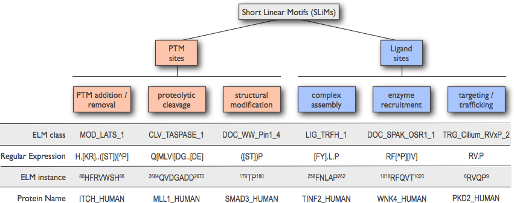
**Figure functional_classification_of_SLiMs** For each ELM class, the functional category to which it belongs is indicated by a three-letter prefix. Each ELM class is defined by a regular expression. Peptide sequences in proteins that match the regular expression of a specific ELM class and that were experimentally validated to be functional motifs are captured as ELM instances of that class. Degrons are a specific subtype of enzyme-recruiting docking motifs (see text for a detailed description).

# Basic protocol 1: explore the manually curated information for the p53 protein in the ELM DB

The core of the ELM database is a repository of manually annotated
motifs and instances. As of December 2016, ELM contains over 260 motif classes
categorized into 6 different types: DOC (docking), LIG (Ligand binding), DEG
(degradation), CLV (cleavage), MOD (post translational modifications), and
TRG (targeting/anchoring) motifs (Figure functional_classification_of_SLiMs). These motifs are derived from various types
of experiments reported in literature. Each manually annotated motif also has a
set of bona fide instances (occurrences) of this motif. The motifs and motif
instances have been uploaded by a large group of annotators from around the
globe. The complete catalogue of manually curated data can be searched, browsed
and explored on the ELM website

In this protocol we will be viewing the manually annotated data of a typical
protein, using p53 (Uniprot ID: P53_HUMAN/P04637) as an example. We will cover how to
find the manually annotated motifs and instances, and how to find the motif
instances, the references used to annotate each instance, the experimental
protocols used, and additional information including relationships to biological
pathways (such as KEGG \cite{26476454}), diseases (from OMIM \cite{17357067}) and molecular switches (in switches.ELM \cite{23550212}).

## Necessary Resources

### Software & Hardware

A modern browser such as Firefox, Chrome, or Safari.
ELM is best viewed on a laptop or desktop computer, although tablets and
smartphones will also work.

## Searching ELM database content


**Figure TP53-BP1-1** The query input page for ELM for predicting motifs in a given protein sequence.

Step 1. Open a browser, and navigate to the ELM homepage: http://elm.eu.org.
Enter the Uniprot ID "P53_HUMAN" in the search field labelled "Enter a uniprot
identifier or accession number". The page should autocomplete/suggest the
protein "P53_HUMAN / P04637 (Homo sapiens)". Click on this entry to confirm
that we want to search for SLiM data for this protein. Click on "Submit" to
view the motif instance data for p53. (Fig. TP53-BP1-1)

> The autocompletion mechanism queries uniprot.org for protein identifier;
> if it succeeds, then additional information from uniprot
> will be used to pre-populate the filter boxes. In this example,
> P53_HUMAN is recognized as a Human protein, and so "Homo sapiens" is
> automatically filled in the "Taxonomic Contenct" field. Also, P53 has manually
> annotated motifs identified in the nucleus, cytosol, endoplasmic reticulum
> and mitochondrion, so these are also automatically applied as search
> criteria. The motif cutoff of "100" is a sufficiently high (lenient) threshold
> to allow all other detected motifs to be shown.

## Browsing annotation details. 

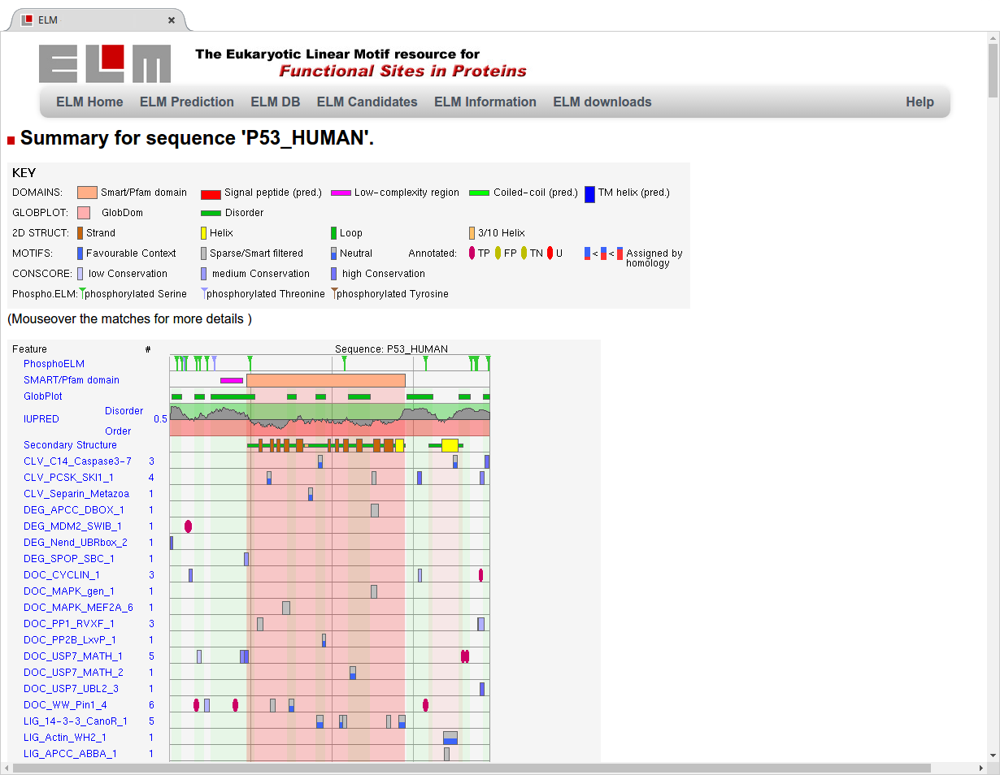
**Figure TP53-BP1-2**

Step 2. The results from the query will open in a new tab (Fig. TP53-BP1-2).
Note that not all motif hits are
shown: the image is chopped off at the bottom. The protein has a handful of
structural features (shown in the top 5 rows). See the legend at the top of the
figure for more information. Motif instances which are manually annotated in
the database appear as red or yellow ovals in the graphic. Blue/gray squares
represent predicted motif occurrences (which are further discussed in Basic
Protocol 3: Predicting ELMs in sequences)


**Figure TP53-BP1- 3**

Step 3. On the results page, scroll down to the heading: "The ELMs in the
following table are known instances annotated from the literature" (Fig TP53-BP1-3).
This table has details of SLiMs which have been manually annotated in the ELM
database. The columns show each motif name, the sequence(s) that matched the
motif as well as their starting and ending positions and the logic of the annotation
followed by a short description of each motif, to which cell compartments its
has been associated, and finally the regular expression of the motif.

> The "Logic" column indicates whether this motif is an example of a functional
> (True Positive, TP) or non-functional (False Positive, FP) motif. A TP
> instance is an instance annotated with experimental evidence showing this
> instance to be functional, whereas a FP is an instance with experimental
> evidence hinting at a function, but after careful inspection our annotators
> believe this instance to be non-functional. There are only rare cases of a
> true negative (TN) instance, which is an annotated instance where experiments
> have shown it to be non-functional.

## Browsing Motif information.

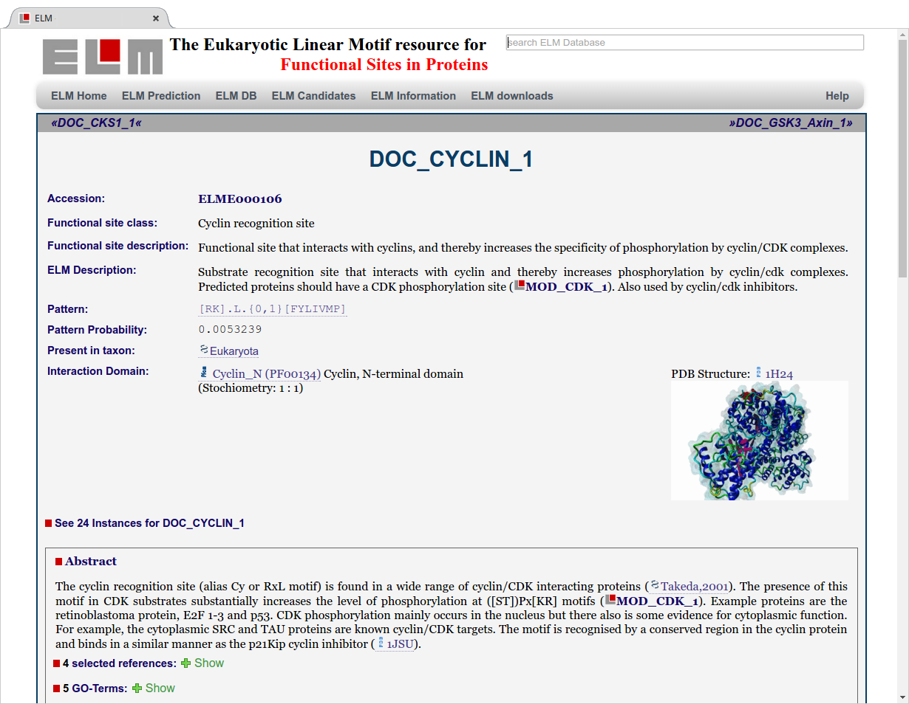
**Figure TP53-BP1- 4** The motif details page for "DOC_CYCLIN_1". This page
contains all of the manual annotation details for the DOC_CYCLIN_1 motif,
the biological background summarized from the scientific literature including
links to the primary literature and to external resources (Pubmed (\cite{27899561}),
GeneOntology (\cite{27899567}), PDB (\cite{12037327}) and more).

Step 4.  Click on "DOC_CYCLIN_1" to navigate to the page with details about the
"DOC_CYCLIN_1" motif (Fig TP53-BP1-4). This page contains a description of the
functional site class (a Cyclin recognition site), and a short description of
the ELM and its regular expression, as well as a probability score, the
taxonomic distribution of the motif and which domain (if any) is responsible
for the interaction.

> The probability score is the probability that the regular expression
> represents a random selection of amino acids (similar to an information
> content score). A lower score indicates that the motif pattern is more 
> difficult to find by chance in a random sequence.

Step 5. Scroll further down the "DOC_CYCLIN_1" page (Fig TP53-BP1-5) to view
more details about the manually annotated data and instances in the database
(to the text box starting with the "Abstract"). The "abstract" contains a more
detailed description of the motif annotation. Click on the "Show" button next
to the "selected references" header for a list of publications relevant to this
motif. Click on "Show" next to "GO terms" for a complete list of all GO terms
annotated for this motif.

Step 6. Scroll further down the "DOC_CYCLIN_1" page (Fig TP53-BP1-5) to view
the "Instances" header. This table contains the list of all annotated
instances in the database of this motif. This includes the protein identifier,
the start and end positions of the instance, the specific sequence matching the
regular expression and the logic of the instance. The "# Ev." indicates the
number of experimental evidences associated with the annotation (see section 
XXX below). Organism is the species in which the protein is found. Lastly the 
"Notes" column contains links to any "interactions" or "switches" present in the
database, as well as links to PDB if this structure exists in PDB.

## Browsing annotated instances

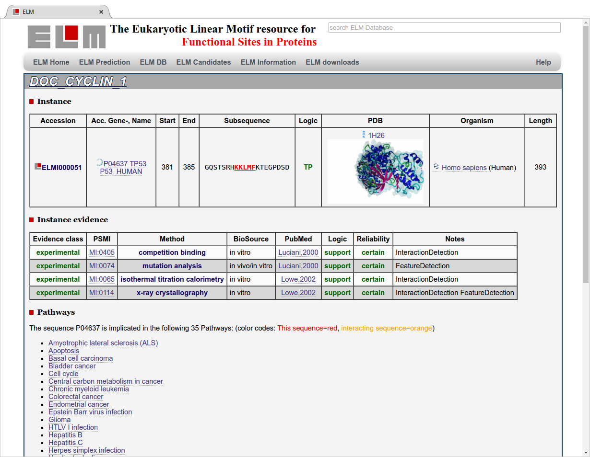
**Figure TP53-BP1- 5** The instance details page for the "DOC_CYCLIN_1"
instance found in P53 with start/end position "381-385".
This page also contains links to many external databases including Uniprot (\cite{25348405}),
PDB (\cite{12037327}), NCBI taxonomy, Pubmed (\cite{27899561}), and KEGG Pathways (\cite{26476454}), 
as well as the PSI-MI controlled vocabulary (\cite{17925023}).

Step 7. Return to the P53 results summary page (Step 3) (by
hitting "back" in the browser), and scroll down the "instances" table.
To get information about the annotated motif instance of "DOC_CYCLIN_1"
(the third instance in Figure TP53-BP1-3) click on the link of its start/finish position
"381-385" to go to the instance details page of this instance. The top part of
the page contains details about the instance and the protein it was identified in.

Step 8. Scroll down to the "Instance Evidence" header to view details on the
experimental evidence used to annotate this instance. This table also contains
the "evidence class", and descriptions of the methods used from PSI-MI (\cite{17925023}) as
well as the Literature references in which the experiments were published.

> (Here we should explain what "evidence class", "biosource", "Logic",
> "Reliability" and "Notes" actually mean).

## Details on molecular switches, motif-mediated pathways and other external resources.

Step 9. Scroll further down to the header "Pathways" to view pathway
information. This is a list of all of the pathways in which the protein p53 is
known to be involved (according to KEGG). Click on a pathway to see the 
localization of p53 in the corresponding KEGG pathway.


**Figure TP53-BP1-6** The instance details page for the "DOC_WW_Pin1_4"
instance found in P53 with start/end position "30-35". 

Step 10. Return to the P53 results summary page (Step 3) (by
hitting "back" in the browser), and scroll down the "instances" table in
Figure TP53-BP1-3. To get information about the first "DOC_WW_Pin1_4" motif,
click on the start/end position "30-35" (Fig TP53-BP1-6). This page is similar to
that described for P53 instance "DOC_CYCLIN_1" (Fig TP53-BP1-5); additionally, for this instance
there is information available about its interaction partner and a molecular switch
which is mediated by this motif instance.

Step 11. Scroll down to the "Interactions" header to view information about
this instance's interactions (Fig TP53-BP1-6). This instance interacts with PIN1_Human via the
"WW" domain (PFAM identifier PF00397; found on position 7--37 in PIN1_Human). If available, binding
affinities are also shown here. Interaction data is made available in Mitab and xml format (\cite{17925023}).

Step 12. Scroll further down to the "Switches" section for a brief overview of
the switches details of this instance obtained form "switches.ELM" (\cite{23550212}) (Fig TP53-BP1-6). This
particular instance is involved in the switch phosphorylating P53. Clicking
on the diagram will open an external link to the "switches.ELM" website.

# Basic protocol 2: Explore the content of the ELM DB

The core of the ELM database is the set of manual annotations of motifs and
instances curated from literature. There are over 3000 annotated instances from
more than 260 classes annotated from over 2500 publications. In this protocol we give an overview on how
to navigate and browse the entire database content. This section should give an
overview of all the data, and types of data contained in the database.

## Database content overview

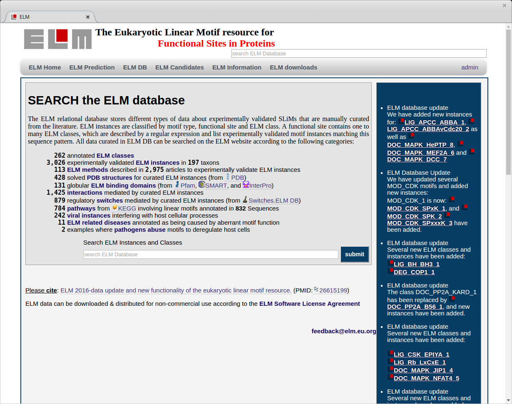
**Figure TP53-BP2-1** The ELM database overview page (elm.eu.org/search.db).

Step 1. Go to http://elm.eu.org and click on the tab "ELM DB" to explore the
content of the different types of data about experimentally validated ELMs that
were manually curated from the literature (Figure TP53-BP2-1). This page
contains a brief summary of the database content, as well as the number of
links to third-party databases.

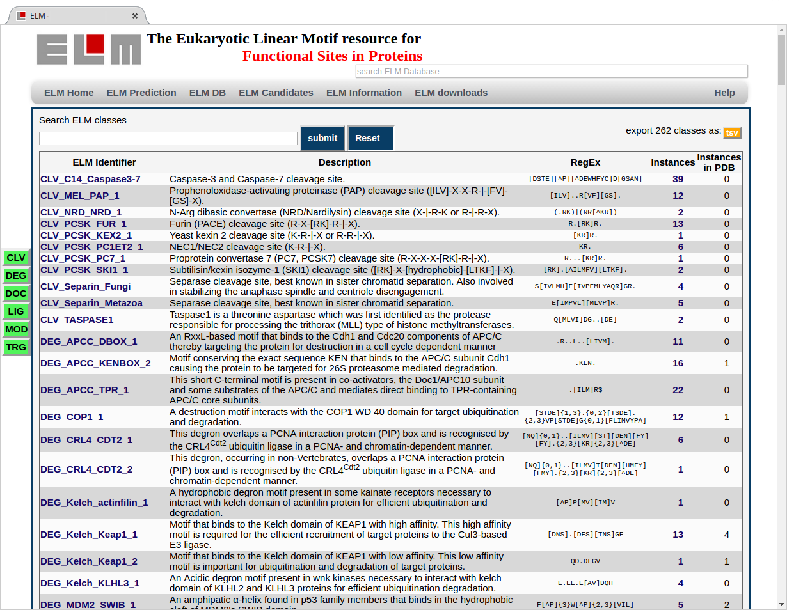
**Figure TP53-BP2-2** The list of all motifs in the ELM database.

Step 2. Click on the sub-menu "ELM classes" in "ELM DB" to see the page with all
of the ELM classes (Figure TP53-BP2-2). For each class, the following
information is provided: ELM identifier, short description, regular
expression, number of instances annotated for each class, and number of
structures available. For details on each class, click on the ELM
identifier; to get a list of annotated instances for an individual class,
click on the number of instances.

> Use the search bar at the top of the page to filter for certain motif
> classes. For example, typing "MAPK" and hitting submit will perform a
> full-text search on all motif classes in the ELM database containing the term "MAPK".
> The green buttons on the left can also be used to filter this
> table. For example, toggling the "DOC" button will remove all "DOC" classes
> from the table (and clicking it again will bring them back). Lastly, the
> yellow tsv link can be used to export all motif classes as a "tab separated
> values" file.


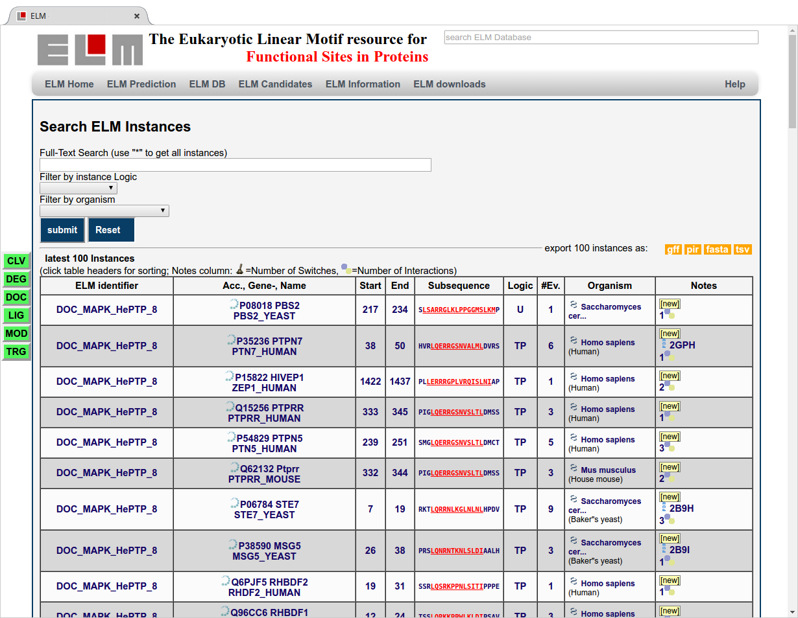
**Figure TP53-BP2-3** The list of all instances in the ELM database.

Step 3. Click on the sub-menu "ELM instances" in "ELM DB" to go to
the page which lists all of the instances in the database (Figure TP53-BP2-3).
This table contains a list of all instances in the database (in the same format
as step XXXX, figure YYY in the previous section).

> Use the search filters at the top of the page to limit the results by a
> full text search, by instance logic, or organisms. Similar to the ELM classes
> page (previous step) these results can be filtered by motif class using the
> green toggle filters on the left hand side. Lastly, the yellow buttons at the
> top of the page can be used to download the instances in the following formats: gff,
> pir, fasta or tsv.

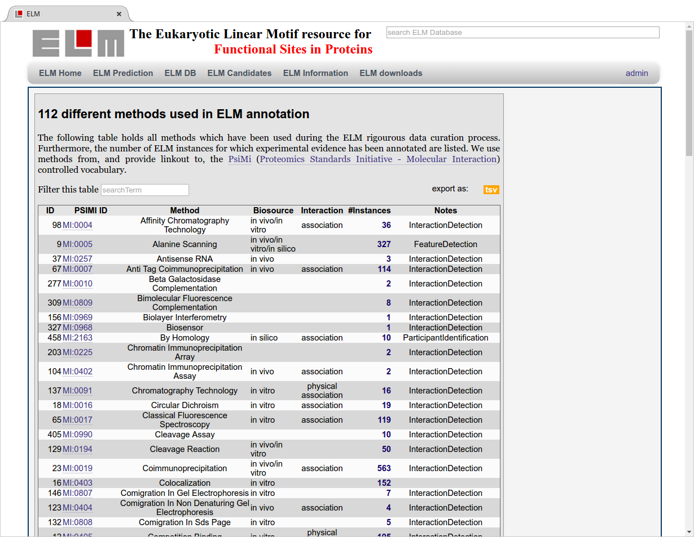
**Figure TP53-BP2-4** The list of all experimental methods used in the ELM database.

Step 4. Click on the sub-menu "ELM methods " in "ELM DB" to see a list
of all experimental methods which have been used to identify motifs and instances (figure
TP32-BP2-4). This table shows the internal method identifier in the first
column, a link to the corresponding entry in the PSI-MI database (\cite{17925023}),
and the method name as annotated by the PSI-MI controlled vocabulary, as well as
the type of experiment (in vitro/in vivo).
Clicking on the link in the "instances" column will list all instances
annotated using that method.

> The filter bar on the top page can be used to filter the list of methods. The
> *tsv* link creates a downloadable file in "tab separated values" format.

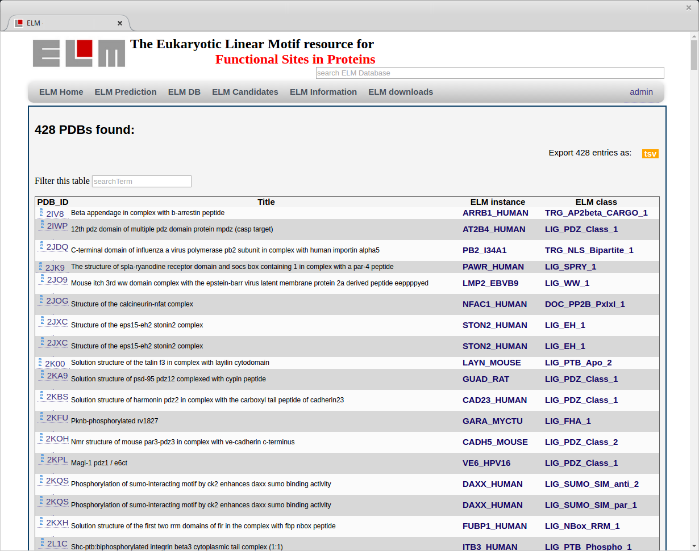
**Figure TP53-BP2-5** The list of all known structures in PDB also in ELM.

Step 5. Click on the sub-menu "ELM pdb structures" in "ELM DB" to see a
list of all macromolecular structures in the ELM database (Figure TP53-BP2-5).
Structures annotated in ELM ideally (but not always) show both interaction partners, motif and domain.
This page also contains links to RCSB (\cite{12037327}), the individual instance and the motif class of that instance.

> The filter bar on the top page can be used to filter the list of structures
> shown . The *tsv* link creates a downloadable file in "tab separated
> values" format. The *tsv* file contains the PDB id, uniprot name, and ELM class.


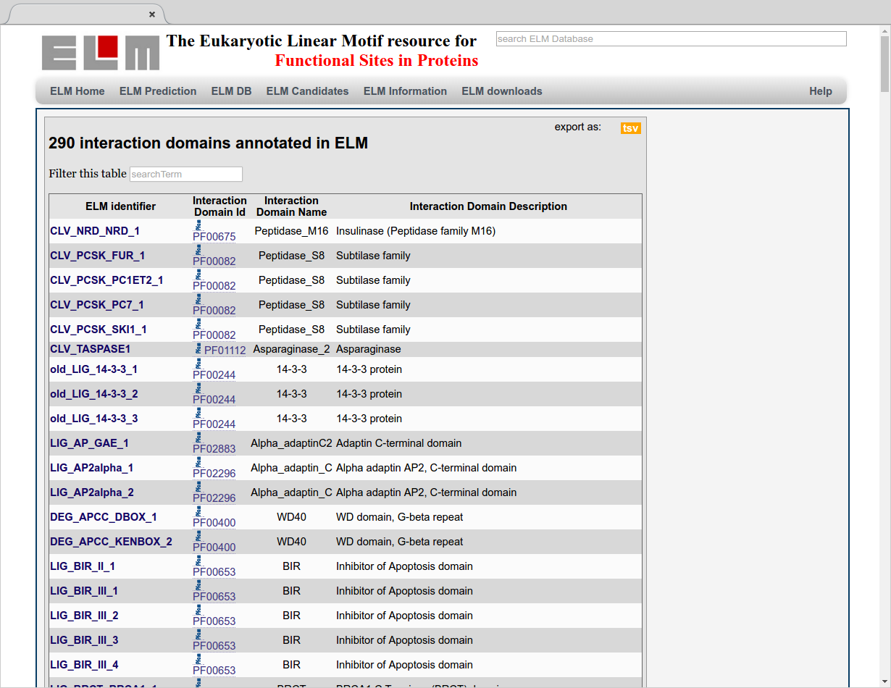
**Figure TP53-BP2-6** A list of all interactions annotated in the database.

Step 6. Click on the sub-menu "ELM binding domains " in "ELM DB" to see a
complete list of all the interaction domains in ELM (Figure TP53-BP2-6).
This table shows the ELM classes which have been annotated with a corresponding
interaction domain. This table shows the ELM class, a link to the Pfam
(\cite{26673716}) / SMART (\cite{25300481}) / InterPro (\cite{27899635}) domain, as
well as the name of the interacting domain followed by a brief description.

> The filter bar on the top page can be used to filter the list of interactions
> shown. The *tsv* link creates a downloadable file in "tab separated
> values" format.

## Links to external resources

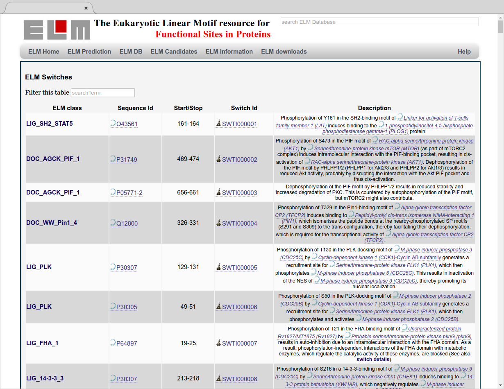
**Figure TP53-BP2-7** A list of all switches annotated in ELM.

Step 7. Click on the sub-menu "ELM switches" in "ELM DB" to see a
complete list of all the switches in ELM (Figure TP53-BP2-7). This table shows
the motif class, contains a link to Uniprot, and the start and stop positions of
the motif mediating the switch. The last two columns have links to switches.ELM, and a brief
description of the switch also taken from switches.ELM (\cite{23550212}).


> The filter bar on the top page can be used to quickly filter the list of interactions
> shown.

## Exploring KEGG pathways from ELM

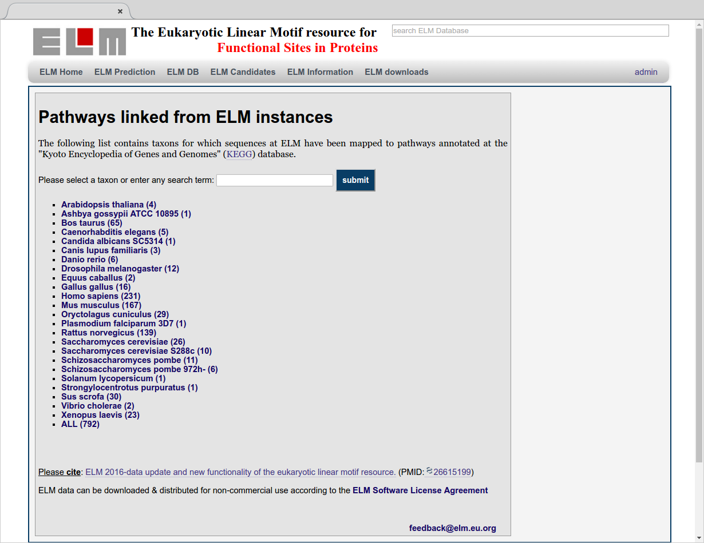
**Figure TP53-BP2-9** A list of all Pathways from KEGG with proteins in ELM.

Step 9. Click on the sub-menu "ELM pathways" in "ELM DB" to see a list of
all pathways contained in ELM (Fig. TP53-BP2-9). Pathways are from the "Kyoto
Encyclopedia of Genes and Genomes" (KEGG \cite{26476454}) database mapped to ELM instances.
Click on a species (for example "Homo sapiens") for a complete list of all Human
pathways which have a protein annotated in ELM, and links to the pathways on KEGG.

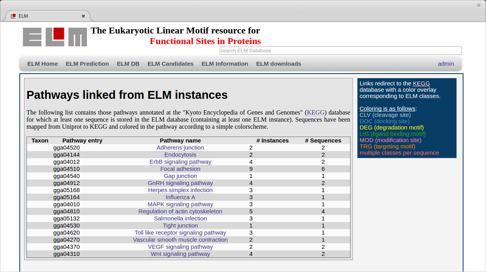
**Figure TP53-BP2-10** A list of all pathways in Gallus Gallus

Step 10. On the "ELM pathways" page (Fig. TP53-BP2-9) click on the link "gallus
gallus" to navigate to the page containing all pathways annotated for chicken.
This page contains links to all KEGG pathways for the taxon *gallus gallus*
with annotated instances in the ELM database.


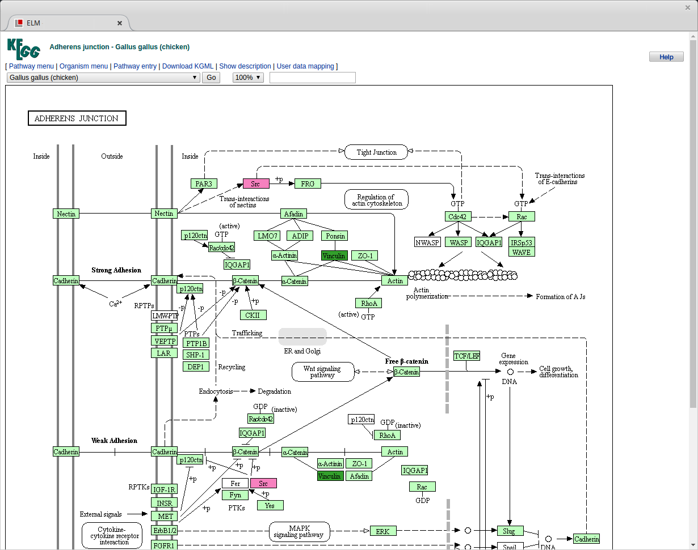
**Figure TP53-BP2-11** A list of all annotated pathways for taxon *gallus gallus*

Step 10. One the page with chicken pathways (Fig. TP53-BP2-10) click on
"Adherens junction" to the KEGG entry for this pathway, with proteins color
overlay corresponding to ELM classes (see the color legend right side of figure
TP53-BP2-10).

## Infections and Diseases

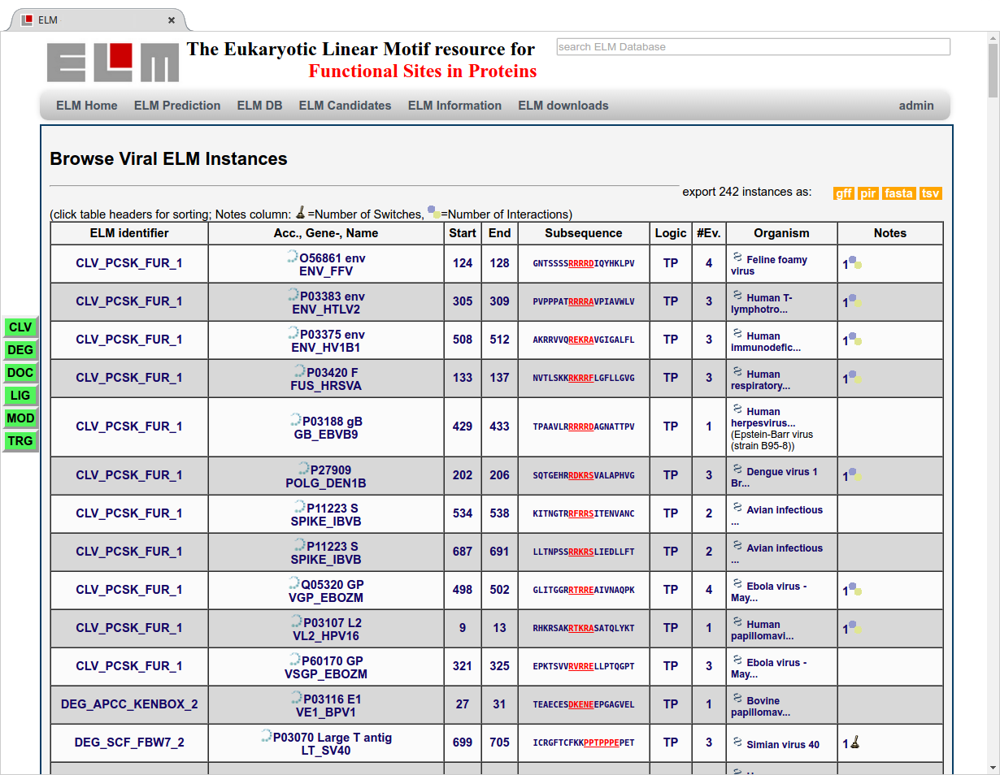
**Figure TP53-BP2-11** A Table of the ELM instance abused by viruses

Step 11. Click on the sub-menu "ELM virus instances" in "ELM DB" to see a
Step 11. Click on the sub-menu "ELM virus instances" in "ELM DB" to see a
list of all instances in ELM that have been annotated as being abused by
viruses (Fig TP53-BP2-9). The columns are identical to those listed in section
XXX step YYY (Figure ZZZZ).

> The green buttons on the left can be used to filter this
> table by motif class. Click on the yellow links on the top right of the page
> to download the (complete) table in giff, pir, fasta or tsv format. (See
> section XXX for a description of these formats.)

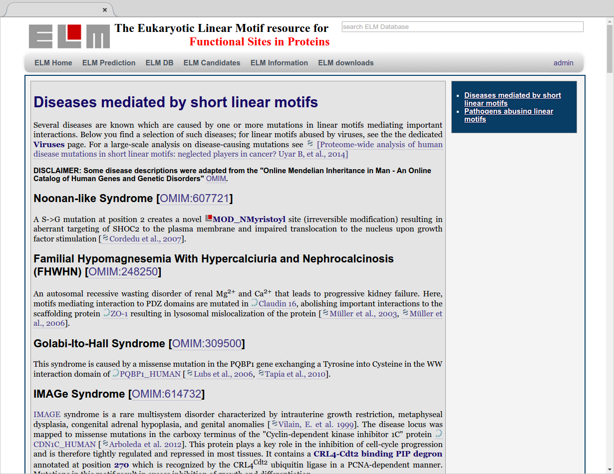
**Figure TP53-BP2-8** A list of all diseases in ELM.

Step 8. Click on the sub-menu "ELM diseases" in "ELM DB" to see a list
of all motif classes that have been annotated with a disease. Disease
information is taken from the OMIM database.

> This table also includes the diseases found under the "ELM pathogenic
> abuse" menu in "ELM DB". (right?)


# Alternate protocol 2: General Search Box

A general search text box is available to explore the manually curated
information in the ELM DB. This is a "Full-text" search which is performed on
selected columns of the database therefore some attention (better term?) should
be applied when evaluating the retrieved results.

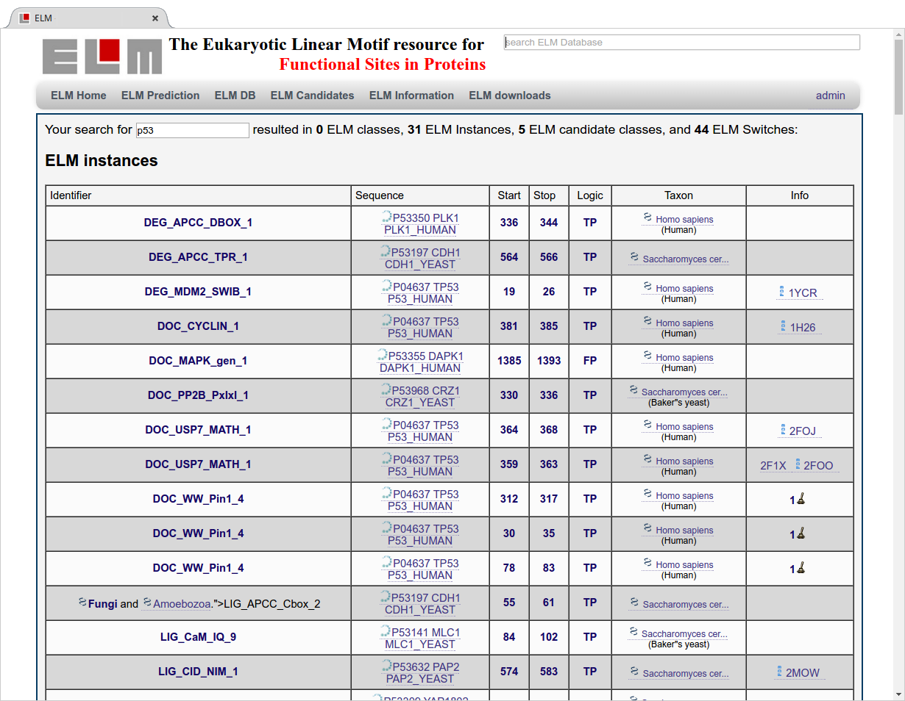
**Figure TP53-AP1-1** 


**Figure TP53-AP1-2** 


**Figure TP53-AP1-3** 

Example 1: perform a search using the keyword ‘p53’. The results are retrieved
in the following section: ELM instances (xx matches), ELM Switch (xx matches),
and ELM Candidate classes (xx matches). One will find proteins such as 
CDH1_YEAST (because of its accession P53197) which may or may not be 
what one wants.


**Figure TP53-AP1-4** 

Example 2: perform a search using the gene id TP53 or the UniProt Acc P04637.
The results are retrieved in the following section: ELM instances (xx matches),
ELM Switch (xx matches).  The retrieved hits are less, but more specific
compared with the search with ‘53’. However, there are no matches in ELM
Candidate classes tough some content is related to the p53 protein.

# Basic Protocol 2: Predicting ELMs in sequences [2 or 3?]

One of the most useful (and used) features in ELM is the ability to detect
motifs in proteins and sequences. Given a protein's amino acid sequence, the
"EML Predictions" pipeline searches for occurrences of each Motif class using
their regular expressions. The presence of each motif is also ......

We will use as an example protein "CV_0974" (uniprot ID: Q7NZE8), a "probable
tyrosine phosphatase" from _Chromobacterium violaceum_. This protein is predicted
to be a tyrosine phosphates because it has a "tyrosine phosphatase" (PTPc) domain.
However its specificity is unknown ???

## Necessary Resources

### Software & Hardware

A modern browser such as Firefox, Chrome, Safari, Internet Explorer or Edge.
ELM is best viewed on a laptop or desktop computer, although tablets and
smartphones will also work.

## Submitting a query to ELM


**Figure BACT-BP-1:** The input query page for finding motifs in ELM. The
sequence for _C. vilaceum protein_ CV_0974 was used as an example for this
protocol.

step 1. Click on the "ELM Predictions" button in the menu to access the search query
   page (Fig. BACT-BP-1). Here you can provide either a protein accession (from
   uniprot) or an amino acid sequence (simply the
   sequence, or a FASTA formatted entry) in which you want to detect SLiMs.
   Retrieve the FASTA formatted sequence from Uniprot
   (http://www.uniprot.org/uniprot/Q7NZE8), and enter it into the "sequence
   input text box".

> As this protein is already present in the ELM database, it is also possible
> to type its identifier (CV_0974) into the "identifier input field" as steps
> XXX and in YYY Basic Protocols 1`& 3. However it is not neccesary to submit
> protein sequences already in the database: any amino acid sequence can
> submitted to the ELM prediction pipeline.

step 2. Select the search criteria (optional). It is possible to limit the
   results by "cell compartment", "taxonomic context" or by changing the "motif
   probability cutoff". To restrict the search to include SLiM's that are
   active in certain cellular compartments, select one or more from the list
   (use the "control" key to select more than one option). It is also possible
   to select a "taxonomic context" to restrict the search to SLiMs from certain
   species. Start typing a species name in the "taxonomic context" input field to
   get an auto-completed list of species to select from.
   Additionaly, a "Motif probability cutoff" can be used to only retain ELM
   classes whose pattern probability is below the given value.
   For the current protocol, leave all of these at their default values: "not
   specified", "100" and no "taxonomic context"

step 3. Click "submit" to start the searching for motifs. 
   You will be brought to an intermediate page indicating that your results are
   being processed, and you should be redirected to the final results page within
   30 seconds.

> You can bookmark this page: The results are stored for a week.

## Interpreting the prediction results: Graphical Summary


**Figure BACT-BP-2:** The graphical results summary of the ELM Prediction pipeline
for Probable Tyrosine phoshate (CV_0974). Note that not all motif
detections are shown (the image is truncated at the bottom). The top five rows show a handfull of 
structural features. The motif occurence are shown as blue boxes, the intensity of which
indicates the conservation score. See steps XXX to YYY for more information.

step 4. The Results are summarized in the first figure on the results page (see
   figure BACT-BP-2). The Graphical summary shows all of the final and
   intermediate results generated by the ELM Prediction pipeline, and can be
   used infer whether or not a motif is present in a sequence, as well as now
   likely it is to be functional based on its structural context and
   evolutionary conservation. 

step 5. The first row contains phosphorylation sites as retrieved from Phospho.ELM
   (\cite{21062810}), and whether the phosphorylated amino acid is a serine, threonine
   or tyrosine. Phospho.ELM is a database of manually annotated phosphorylation
   sites obtained from scientific publications from low and high-throughput experiments. You can follow the link
   to Phospho.ELM by clicking on the phosphorylation site in the image.

> Phosphorylation sites are only available when the search is performed
> with a protein accession in step XXX.  Phosphorylation sites are relevant to
> interprete ELM motif predictions when
> the predicted motif requires to be phosphorylated (as in several docking and
> ligand binding motifs) and naturally, for the prediction of phosphorylation
> motifs.

step 6. The second row shows SMART and Pfam domains detected by the SMART
   database (\cite{9600884},\cite{25300481}, \cite{9600884}). Hover the mouse over these domains to
   see their names and exact start and end positions.

> In order to be functional SLiMs need to be accessble, and are therefore they
> are usually not > found within domains and structured regions (\cite{21909575}). Any
> SLiMs detected by the ELM prediction pipleline are less likely to be
> functional, and are filtered out by the "structural filter" (see also step XXX).

step 7.  The third row shows globular and disordered regions in the sequence as
    predicted by GlobPlot (\cite{12824398}). The 4th & 5th
    rows contain results from IUPred (\cite{15955779}), another unstructured region
    prediction tool. Protein segments with an IUpred score above 0.5 are 95% likely
    to be disorered (REF???).

>  SLiMs are typically only functional when found in intrinsically disordered
>  regions. Any motif occurence detected by the ELM prediction pipeline that
>  fall within disoredered regious are more likely to be functional.

step 8. The 5th row contains information on secondary structure. The secondary
   structure is predicted using a ?????

step 9. The remainder of the figure (from row 6 onwards) displays the motif
   detections, overlayed by the structural context from rows 2 and 3 (SMART
   domains and GlobPlot). A blue square indicates a single motif occurence,
   intensity of the color indicates the conservation of this sequence in
   homologous proteins.
   Boxes in gray are motif occurences which have been filtered out by the "structure
   filter". Boxes that are blue & gray are neutral (what does that mean ?????).
   If the sequence is already present in the database, any motif instances
   that have already been annotated are shown as ovals. Lastly, Any motifs
   detected in homologous sequences are also shown as blue & red rectangles.

> In the case that no homologous sequences were detected (see step XXX below),
> it is not possible to assign a conservation score. Therefore all of the
> motif occurences will be shown in a uniform shade of blue.

step 10. Place the cursor over the blue box for motif occurence
   "DOC_USP7_MATH_1" at position 129-133. This motif is in a disorered region, and
   has not been filtered out by the structural filter. However, its
   conservation score is extremely low: 0.000, indicating it is not conserved
   in homologous proteins. Place the cursor over motif "DOC_MAPK_DCC_7" at
   positions "334-343". Despite the high conservation score (1.000), this motif
   is inside the PTPc domain (and a Globular regions), and therefore has been
   filtered out.

> The confidence score is based on how conserved the sequence is across a set
> of homolous proteins from other sequences. An exact description of the method
> is given in ????

step 11. Mouse over a gray rectangle (filtered out) to find out why this hit was
   filtered out. It shows scores for all of the individual criteria used to
   filter out a sequence: The name of the domain, the *accessibility score* ,
   *secondary structure score*, *combined total score*, and the associated
   *totalscore P-value*. It also shows the sequence which cased matched the
   motif's regular expression. **Skip this one, its not working!**

## Interpreting the prediction results: Additional Information


**Figure BACT-BP-3:** This section of the results contains additional details
of alignment of homologous proteins, filtering results and globular domains.

step 12. Scroll down to below the results graphic to find additional
   information on the ELM Predction pipeline's results (figure BACT-BP-3).
   The first section contains links to download or view the multiple sequence
   alignments of homologous proteins used to calculate the conservation score.
   Click on the link "Click here to enable the multiple sequence alignment
   viewer" to open the alignment in Jalview (note: this requires the Java browser
   plugin, which is not available on some newer operating systems).
   Alternatively you can also download the "alignment", "conservation features"
   and "phosphosite features" files separately to view on a standard
   (non-browser) installation of Jalview.

> The search for possible homologs is performed against the UniRef90
> database, a dataset of protein sequences with less than 90 percent identity
> between any two of them (\cite{25348405}). It is also possible that 
> that the BLAST results are not finished when the results page is shown: We
> suggest to refresh the page if you see the message "Either not enough data
> available to calculate a sequence alignment or the calculations haven't
> finished yet". In some cases it is also possible that no homologs will be
> detected. If you have refreshed the page after waiting for more than 3
> minutes, this is most likely the case.

step 13. Scroll down to the section titled "Filtering Summary" to
   view some statistics about how many motifs and instances were filtered
   out (figure BACT-BP-3). The first two lines contain information on whether and which filters were
   applied in step XXX of this protocol. The next two lines (SMART & Structural
   score) show how many motifs and instances were removed by the SMART and
   Secondary structure filters. The "Retained by" section shows how many motif
   hits were not filtered out by the "Smart" or "Structural Score" filter. In
   this example a total of 156 instances (of 54 different motifs were
   identified), of which 63 instances (and 16 motifs) were filtered out as they
   occured in a SMART domain.

> Note that the graphical summary above does not contain sequences filtered
> out by the "cell compartment" and "taxonomic context" filters (in step XXX).
> However those filtered out by by the SMART and Structural scores are shown in the
> graphic above (as gray rectangles). If any "cell compartment" or "taxonomic
> context" filters are selected in step XXX, the number of motifs and instances
> are also shown in this table.

step 14. Scroll down to the section with the header "Globular domains/ TM
   domains and signal peptide detected by the SMART server" (Figure BACT-BP-3). This section
   contains information on which domains were detected by the SMART
   server, and their positions. Clicking on their names will bring you to the
   SMART entry for that domain on the SMART homepage.

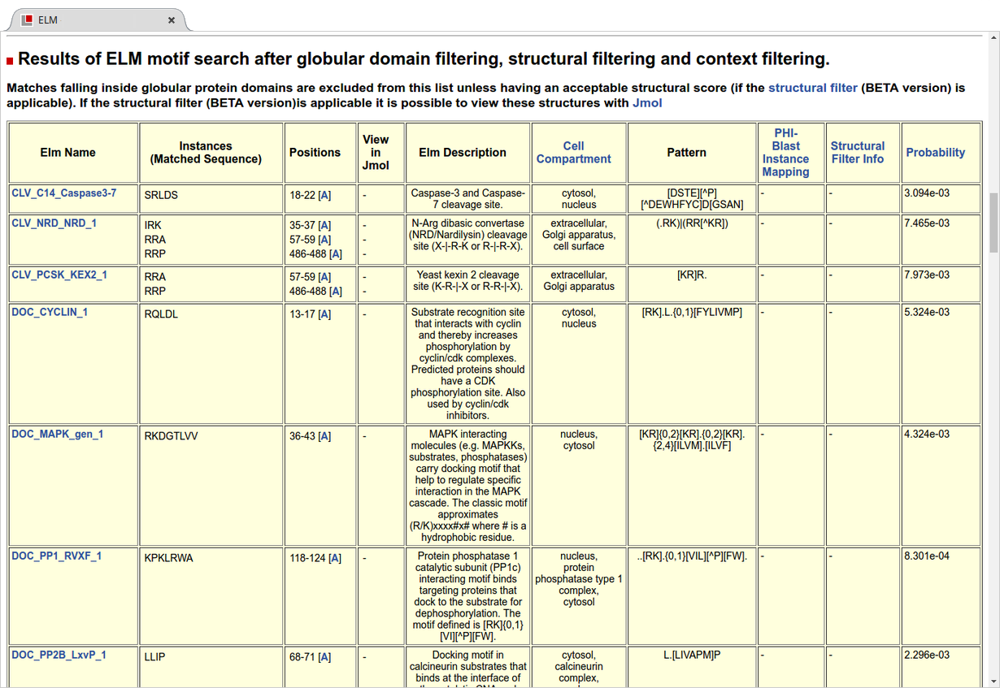
**Figure BACT-BP-7:** This table contains the list of motifs detected in the
sequence (only the top part of the table is shown).

step 16. Scroll further down to the section title "Results of ELM motif
   search after globular domain filtering, structural filtering and context
   filtering" to obtain an overview of all of the motifs and motif instances
   detected (Figure BACT-BP-7). Each row also contains information on the Motif name, the matching
   peptide sequence and its position. Additional information is shown about the ELM, cell compartment and its regular
   expression. If the motif was detected in a homologue, the column called
   "PHI-Blast Instance mapping" contains links to the Sequence alignment of
   the homologous protein, and a summary of the ELM instance mapper output. If a
   motif instance has been filtered out due to Structural criteria (SMART or
   Structure), this column contains a link to a page with details on how
   individual criteria that make up this filter. The last column contains
   information on the Probability filter: the probability reflects the chance
   to observe this motif in any random amino acid sequence.


**Figure BACT-BP-8:** This table contains the list of motifs detected in the
sequence (only the top part of the table is shown) which were excluded due to
structural filters.

step 17. Scroll further down to the heading "List of excluded ELMs falling inside
   SMART/PFAM domains and/or scoring poorly with the structural filter (if
   applicable)." (Figure BACT-BP-8). This table is (almost) identical to the
   one above, but shows motif instances which were rejecte by the Structural
   filter or SMART filter.

# Alternate Protocol 1: Predicting ELMS in sequences using REST API

Querying ELM for motifs in a given sequence (as discussed in basic protocol 1),
gives you a nice overview of putative and possibly annotated motifs in your
query protein with a graphical representation using colors to highlight
different regions of the protein sequence (eg. disordered vs. globular).
It is however difficult to analyse a large set of protein sequences in this
manner. Therefore, elm.eu.org provides an interface which you can use to submit your sequence
in a programmatic way. Of course, this way, you won't receive the graphical
output representation, but are limited to textual data representation.

Currently, there exists a single URL 'http://elm.eu.org/start_search/' to
accept such queries. You can choose to either submit a uniprot name or accession
(ex. 'http://elm.eu.org/start_search/P53_HUMAN.tsv') or submit your raw
sequence (ex. 'http://elm.eu.org/start_search/MAPRGFSCLLLLTSEIDLPVKRRA').

The logic here is, if the URL ends in '.tsv' then the server assumes you
are using a Uniprot id or accession; if it doesn't, then it assumes you are
using raw sequence. See below for details.

## Necessary Resources

### Software

Ideally use `curl` https://curl.haxx.se/ on the commandline
However, any browser can be used to access the server, most browsers however download text- and csv-files instead of displaying them. Therefore, for trying out different URLs / Parameters, it might be better to use a commandline client such as `curl`.

## Submitting a query to ELM via REST

step 1. Use `curl` to query ELM via uniprot name 'http://elm.eu.org/start_search/P53_HUMAN.tsv'

```
> curl 'http://elm.eu.org/start_search/P53_HUMAN.tsv'

CLV_C14_Caspase3-7	183	187	False	False	False	False	False	False	False
CLV_C14_Caspase3-7	349	353	False	False	False	False	False	False	False
CLV_C14_Caspase3-7	388	392	False	False	False	False	False	False	False
CLV_NRD_NRD_1	174	176	False	False	False	False	False	False	False
CLV_NRD_NRD_1	248	250	False	False	False	False	False	False	False
CLV_NRD_NRD_1	282	284	False	False	False	False	False	False	False
CLV_NRD_NRD_1	289	291	False	False	False	False	False	False	False
CLV_PCSK_FUR_1	280	284	False	False	False	False	False	False	False
CLV_PCSK_KEX2_1	174	176	False	False	False	False	False	False	False
CLV_PCSK_KEX2_1	248	250	False	False	False	False	False	False	False
CLV_PCSK_KEX2_1	282	284	False	False	False	False	False	False	False
CLV_PCSK_KEX2_1	305	307	False	False	False	False	False	False	False
CLV_PCSK_PC1ET2_1	305	307	False	False	False	False	False	False	False
CLV_PCSK_SKI1_1	120	124	False	False	False	False	False	False	False
CLV_PCSK_SKI1_1	249	253	False	False	False	False	False	False	False
CLV_PCSK_SKI1_1	305	309	False	False	False	False	False	False	False
CLV_PCSK_SKI1_1	382	386	False	False	False	False	False	False	False
CLV_Separin_Metazoa	171	175	False	False	False	False	False	False	False
DEG_APCC_DBOX_1	248	256	False	False	False	False	False	False	False
DEG_MDM2_SWIB_1	19	26	True	False	False	False	False	False	False
DEG_Nend_UBRbox_2	1	3	False	False	False	False	False	False	False
DEG_SPOP_SBC_1	92	96	False	False	False	False	False	False	False
DOC_CYCLIN_1	24	27	False	False	False	False	False	False	False
DOC_CYCLIN_1	306	309	False	False	False	False	False	False	False
DOC_CYCLIN_1	381	385	True	False	False	False	False	False	False
DOC_MAPK_gen_1	248	254	False	False	False	False	False	False	False
DOC_PP1_RVXF_1	108	114	False	False	False	False	False	False	False
DOC_PP1_RVXF_1	379	386	False	False	False	False	False	False	False
DOC_PP1_RVXF_1	380	386	False	False	False	False	False	False	False
DOC_PP2B_LxvP_1	188	191	False	False	False	False	False	False	False
DOC_USP7_MATH_1	34	38	False	False	False	False	False	False	False
DOC_USP7_MATH_1	359	363	True	False	False	False	False	False	False
DOC_USP7_MATH_1	364	368	True	False	False	False	False	False	False

...
```

step 2. Use `curl` to query ELM via protein sequence using the URL 'http://elm.eu.org/start_search/MAPRGFSCLLLLTSEIDLPVKRRA'

```
> curl 'http://elm.eu.org/start_search/MAPRGFSCLLLLTSEIDLPVKRRA'

elm_identifier	start	stop	is_annotated	is_phiblastmatch	is_filtered	phiblast	topodomfilter	taxonfilter	structure
CLV_NRD_NRD_1	22	24	False	False	False	False	False	False	False
CLV_PCSK_KEX2_1	21	23	False	False	False	False	False	False	False
CLV_PCSK_KEX2_1	22	24	False	False	False	False	False	False	False
CLV_PCSK_PC1ET2_1	21	23	False	False	False	False	False	False	False
LIG_14-3-3_CanoR_1	4	12	False	False	False	False	False	False	False
LIG_BIR_II_1	1	5	False	False	False	False	False	False	False
LIG_FHA_1	11	17	False	False	False	False	False	False	False
LIG_SUMO_SIM_anti_2	7	15	False	False	False	False	False	False	False
LIG_SUMO_SIM_par_1	7	15	False	False	False	False	False	False	False
LIG_SUMO_SIM_par_1	8	15	False	False	False	False	False	False	False
LIG_WD40_WDR5_VDV_2	13	18	False	False	False	False	False	False	False
LIG_WD40_WDR5_VDV_2	14	18	False	False	False	False	False	False	False
LIG_WD40_WDR5_VDV_2	15	18	False	False	False	False	False	False	False
```


TODO: add this information to the download page

TODO: maybe rename `start_search` to `query`?

# Alternate Protocol 2: Searching the ELM database using REST API


## Necessary Resources

### Software

Ideally use `curl` https://curl.haxx.se/ on the commandline.
However, any browser can be used to access the server, most browsers however download text- and csv-files instead of displaying them. Therefore, for trying out different URLs / Parameters, it might be better to use a commandline client such as `curl`.

## Downloading all ELM classes

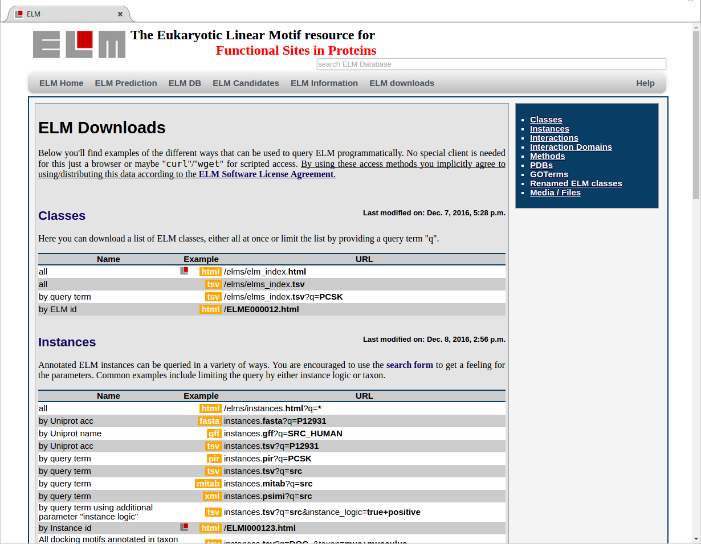

**Figure ELM-Downloads:** The ELM downloads page, which holds information about
the different types of data (such as "Classes", "Instances", etc; see menu to
the right) that can be obtained from the server. The orange boxes are clickable
links, the URL following them are used to highlight the URL scheme used by the
server (bold font denotes specifics used in the examples such as query terms,
or formats).

step 1. Direct your browser to the URL 'http://elm.eu.org/downloads' or choose 'ELM Downloads' from the Menu at 'http://elm.eu.org' (see the [/Figures/elm_downloads_html.png](screenshot) figure showing the ELM downloads website).

> This webpage contains links and descriptions on how to download ELM data in text format.
> The information is separated in individual tables, eg. for 'Classes', 'Instances', and so on...
> Note that each table also shows the 'last modified date' indicating when the particular data was last updated.
> This is useful if you regularly want to update your local data with ELM data, as you can quickly check whether you actually _need_ to download the files again...
> Note the orange colored download links highlighting different formats:
> For many pages, which exist in html format (ending in '.html'), there also exists an additional URL/file extension to get the data in other formats.

step 2. Click on the first orange 'html' link in the table "Classes" or use the following URL: 'http://elm.eu.org/elms.html'

> This webpage shows all annotated ELM classes.
> Next, we are going to use the query parameter 'q' to limit our search

step 3. Use the following URL: 'http://elm.eu.org/elms.html?q=CSK'

> This will again show the webpage with all annotated ELM classes, this time however limited to those matching the query term 'PCSK'.
> Next, we are going to use the same URL pattern, but with '.tsv' to download the same data as actual data, not HTML.

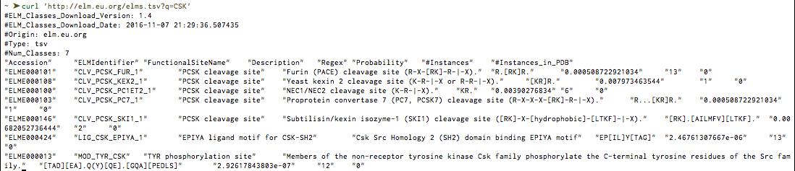
**Figure ELM-Curl-Classes**:
Screenshot of a terminal window using `curl` to download all ELM classes matching the term 'CSK'.

step 4. Use the following URL: 'http://elm.eu.org/elms.tsv?q=CSK'

> By exchanging the '.html' part of the url with '.tsv', we ask the webserver to give us the data in TSV (tab-separated) format.
> This query should download a file such as the following:
```
> curl 'http://elm.eu.org/elms.tsv?q=CSK'
#ELM_Classes_Download_Version: 1.4
#ELM_Classes_Download_Date: 2016-11-06 17:39:41.503341
#Origin: elm.eu.org
#Type: tsv
#Num_Classes: 7
"Accession"	"ELMIdentifier"	"FunctionalSiteName"	"Description"	"Regex"	"Probability"	"#Instances"	"#Instances_in_PDB"
"ELME000101"	"CLV_PCSK_FUR_1"	"PCSK cleavage site"	"Furin (PACE) cleavage site (R-X-[RK]-R-|-X)."	"R.[RK]R."	"0.000508722921034"	"13"	"0"
"ELME000108"	"CLV_PCSK_KEX2_1"	"PCSK cleavage site"	"Yeast kexin 2 cleavage site (K-R-|-X or R-R-|-X)."	"[KR]R."	"0.007973463544"	"1"	"0"
"ELME000100"	"CLV_PCSK_PC1ET2_1"	"PCSK cleavage site"	"NEC1/NEC2 cleavage site (K-R-|-X)."	"KR."	"0.00390276834"	"6"	"0"
"ELME000103"	"CLV_PCSK_PC7_1"	"PCSK cleavage site"	"Proprotein convertase 7 (PC7, PCSK7) cleavage site (R-X-X-X-[RK]-R-|-X)."	"R...[KR]R."	"0.000508722921034"	"1"	"0"
"ELME000146"	"CLV_PCSK_SKI1_1"	"PCSK cleavage site"	"Subtilisin/kexin isozyme-1 (SKI1) cleavage site ([RK]-X-[hydrophobic]-[LTKF]-|-X)."	"[RK].[AILMFV][LTKF]."	"0.00682052736444"	"2""0"
"ELME000424"	"LIG_CSK_EPIYA_1"	"EPIYA ligand motif for CSK-SH2"	"Csk Src Homology 2 (SH2) domain binding EPIYA motif"	"EP[IL]Y[TAG]"	"2.46761307667e-06"	"13"	"0"
"ELME000013"	"MOD_TYR_CSK"	"TYR phosphorylation site"	"Members of the non-receptor tyrosine kinase Csk family phosphorylate the C-terminal tyrosine residues of the Src family."	"[TAD][EA].Q(Y)[QE].[GQA][PEDLS]"	"2.92617843803e-07"	"12"	"0"
```


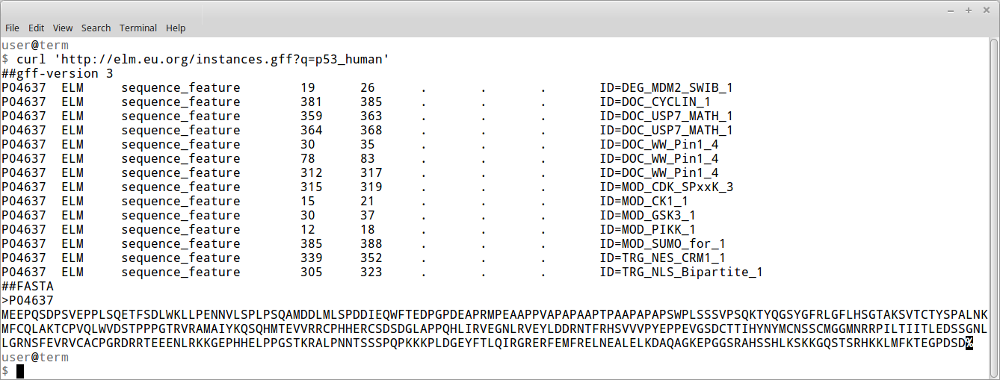
**Figure ELM-Curl-Instances-P53**:
Screenshot of a terminal window using `curl` to download all ELM instances annotated for sequence p53_human.


step 4. Use the following URL: 'http://elm.eu.org/instances.gff?q=p53_human'

```
> curl 'http://elm.eu.org/instances.gff?q=p53_human'
##gff-version 3
P04637	ELM	sequence_feature	19	26	.	.	.	ID=DEG_MDM2_SWIB_1
P04637	ELM	sequence_feature	381	385	.	.	.	ID=DOC_CYCLIN_1
P04637	ELM	sequence_feature	359	363	.	.	.	ID=DOC_USP7_MATH_1
P04637	ELM	sequence_feature	364	368	.	.	.	ID=DOC_USP7_MATH_1
P04637	ELM	sequence_feature	30	35	.	.	.	ID=DOC_WW_Pin1_4
P04637	ELM	sequence_feature	78	83	.	.	.	ID=DOC_WW_Pin1_4
P04637	ELM	sequence_feature	312	317	.	.	.	ID=DOC_WW_Pin1_4
P04637	ELM	sequence_feature	15	21	.	.	.	ID=MOD_CK1_1
P04637	ELM	sequence_feature	30	37	.	.	.	ID=MOD_GSK3_1
P04637	ELM	sequence_feature	12	18	.	.	.	ID=MOD_PIKK_1
P04637	ELM	sequence_feature	385	388	.	.	.	ID=MOD_SUMO_for_1
P04637	ELM	sequence_feature	339	352	.	.	.	ID=TRG_NES_CRM1_1
P04637	ELM	sequence_feature	305	323	.	.	.	ID=TRG_NLS_Bipartite_1
##FASTA
>P04637
MEEPQSDPSVEPPLSQETFSDLWKLLPENNVLSPLPSQAMDDLMLSPDDIEQWFTEDPGPDEAPRMPEAAPPVAPAPAAPTPAAPAPAPSWPLSSSVPSQKTYQGSYGFRLGFLHSGTAKSVTCTYSPALNKMFCQLAKTCPVQLWVDSTPPPGTRVRAMAIYKQSQHMTEVVRRCPHHERCSDSDGLAPPQHLIRVEGNLRVEYLDDRNTFRHSVVVPYEPPEVGSDCTTIHYNYMCNSSCMGGMNRRPILTIITLEDSSGNLLGRNSFEVRVCACPGRDRRTEEENLRKKGEPHHELPPGSTKRALPNNTSSSPQPKKKPLDGEYFTLQIRGRERFEMFRELNEALELKDAQAGKEPGGS
```

step 5. Use the following URL: 'http://elm.eu.org/instances.tsv?q=CLV_&taxon=aedes+agypti'

> Use the query term 'q=CLV_' to get all instances of cleavage site classes.
> To limit your search to 'yellow fever mosquito' instances, use the parameter 'taxon=' followed by the taxon's scientific name, replacing spaces with '+':

```
> curl 'http://elm.eu.org/instances.tsv?q=CLV_&taxon=aedes+agypti'
```

More data (interactions, domains, methods, etc.) can be downloaded from ELM in
analogous fashion. Different formats are available depending on data type (the most
common format is TSV), for example ELM instances can be downloaded in TSV, FASTA, GFF, PIR,
or PSI-MI format (either XML or MiTab) [24067240].

% NOTE: TODO: Mention ELM software license agreement?

# Guidelines for Interpreting Results 

*instructions: A brief discussion of the theory and applications of your*

*notes: Maybe mention how findings are relevant to the lab? For example:
Manually annotated content should be reliable, although one should look at the
'confidence' in the instance annotation. Predictions are probably trustworthy,
but you need to take into account the 'confidence score', and other features
like whether its in a domain, etc...*


# Commentary: 

*instructions: A brief discussion of the theory and applications of your*

## Background Information

*instructions: A brief discussion of the theory and applications of your
procedure.*

## Critical Parameters and Troubleshooting

*instructions: optionally 2 separate sections.*


# Internet Resources with Annotations

http://www.clustal.org/omega
Clustal Omega (\cite{21988835}) is a tool for the alignment of multiple nucleic acid and protein sequences.

http://www.jalview.org
Jalview (\cite{19151095}) is a Java desktop application (and browser applet) that
employs web services for sequence alignment and visualization.

http://proviz.ucd.ie
ProViz (\cite{27085803})
is an interactive protein exploration tool, which searches several databases for
information about a given query protein. Data relevant to the protein like an
alignment of homologues, linear motifs, post translational modifications,
domains, secondary structure, sequence variations and others are graphically
represented relative to their position in the protein.

